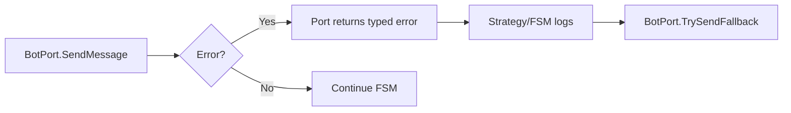
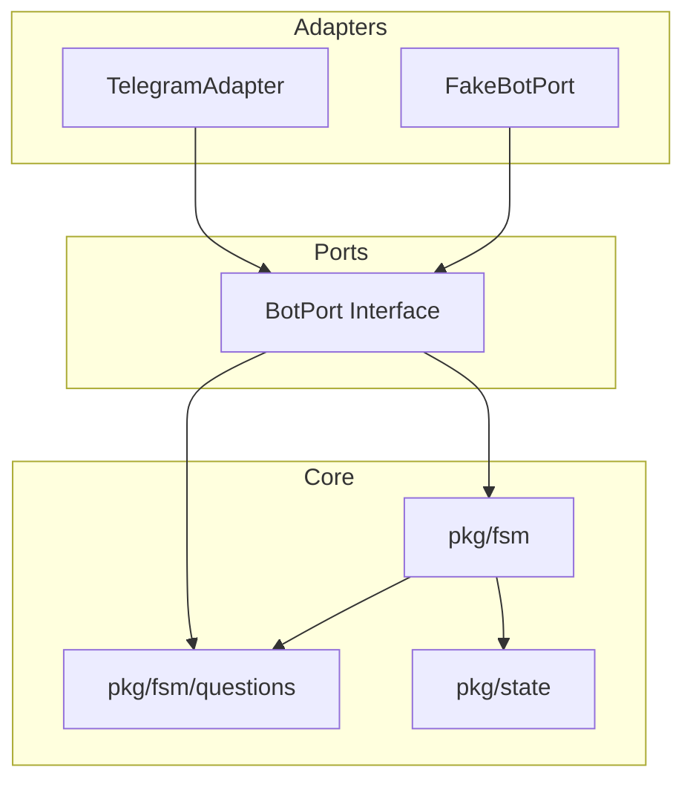
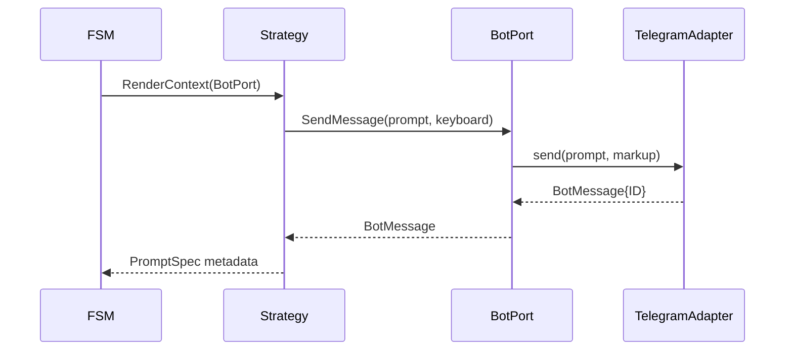
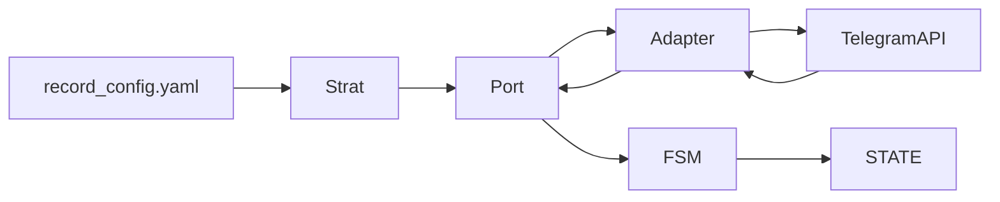
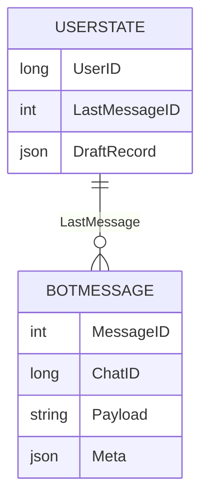

name: "BotPort Evolution PRD"
description: "Plan to fully abstract Telegram interactions behind a testable BotPort layer and integrate it throughout the FSM/question strategy stack."

---

1. **Executive Summary**

## Problem Statement
Current handlers call `pkg/bot.Client` directly, mixing transport concerns with FSM orchestration. Only the new question strategies see a tiny `BotPort`, so the rest of the codebase is still tightly coupled to Telegram types, making mocks painful and future transport swaps (e.g., WebApp, HTTP API, Slack bridge) risky.

## Solution Overview
Define a first-class `BotPort` interface covering all Telegram operations (send/edit, callbacks, typing, keyboard removal, pin/unpin, file uploads placeholder) and inject it everywhere (`main.go`, FSM handlers, question strategies, future integration tests). Provide adapters for real Telegram (`pkg/bot`) and for tests (in-memory logger/recorder). Update state transitions and contexts to accept the interface, ensuring no package reaches for concrete `bot.Client`.

## Success Metrics
- Reduce direct references to `bot.Client` outside adapters to zero (validated via `git grep "pkg/bot"` in non-adapter files).
- Ability to run headless FSM tests by swapping in a fake BotPort, measured by ≥5 new integration-style tests that never touch Telegram.
- Regression risk lowered: integration harness simulates `/start`, section selection, and question flow entirely through BotPort fakes.

---

2. **Problem & Solution**

### Business / Technical Alignment
- **Maintainability:** Operators can extend question strategies, FSM transitions, or integration tests without wiring Telegram dependencies manually.
- **Testing:** A unified port enables deterministic tests (no network tokens), supporting the new integration-test roadmap item.
- **Extensibility:** Future transports (e.g., Slack, mock CLI) simply implement BotPort; FSM/question strategies remain untouched.

### Current Pain Points
- FSM callbacks instantiate `bot.Client` directly, preventing interface substitution.
- Strategies only see `SendMessage`/`EditMessageText`, so other operations (typing, callbacks) remain unmockable.
- Integration tests cannot inject test doubles, blocking automated regression coverage.

### Proposed Remedy
1. Define `BotPort` + `BotMessage` primitives under `pkg/ports/botport` (or `pkg/app/ports`).
2. Provide adapters: `pkg/bot/telegram_adapter.go` implements the port; tests use `pkg/bot/fake`.
3. Update contexts (RenderContext, AnswerContext, FSM events) to accept the interface.
4. Add wiring for dependency injection: `main.go` builds the real adapter, passes to FSM + state store.
5. Document port contract, integration points, and extension recipes in `/docs/botport.md`.

---

3. **User Stories (with diagrams)**

### Persona
- **Maintainer/Operator** – extends logic, runs tests, deploys the bot.
- **QA Automation** – builds regression suites relying on deterministic BotPort.

### Primary Flow Diagram (happy path)
```mermaid
graph LR
    A[Bot receives update] --> B[FSM HandleUpdate]
    B --> C[Resolve BotPort from context]
    C --> D{State?}
    D -->|RecordIdle| E[Send main menu via BotPort.SendMessage]
    D -->|AnsweringQuestion| F[Strategy.Render(ctx)]
    F --> G[BotPort.EditMessage]
    G --> H[User reply]
```

### Error Flow Diagram (BotPort failure)


### User Stories
1. **As a maintainer**, I want every FSM handler to depend on an interface so that I can run the bot logic with fake transports.
   - Acceptance Criteria:
     - [ ] All functions in `pkg/fsm` accept `BotPort`.
     - [ ] Tests can inject fakes without touching Telegram.
     - Edge Cases: BotPort errors (network, rate limit) propagate with actionable messages.
2. **As a QA engineer**, I want to script flows via a fake port so that integration tests verify dialogues without real tokens.
   - Acceptance Criteria:
     - [ ] Provide `FakeBotPort` with recorded interactions.
     - [ ] Example test covers `/start` → add record → text + button question path.
     - Edge Cases: Callback answers referencing stale message IDs.
3. **As an operator**, I want documentation on extending BotPort so that future channels (Slack/CLI) can reuse FSM states.
   - Acceptance Criteria:
     - [ ] `docs/botport.md` lists required methods, error semantics, payload formatting.
     - [ ] At least one example adapter (Telegram) plus placeholder for others.

---

4. **Technical Architecture (with diagrams)**

### System Components


### Sequence: Sending a prompt


### Data Flow


---

5. **API Specifications**

### BotPort Interface (Go)
```go
type BotPort interface {
    SendMessage(ctx context.Context, chatID int64, text string, markup interface{}) (BotMessage, error)
    EditMessage(ctx context.Context, chatID int64, messageID int, text string, markup interface{}) (BotMessage, error)
    AnswerCallback(ctx context.Context, callbackID string, text string) error
    RemoveReplyKeyboard(ctx context.Context, chatID int64, text string) (BotMessage, error)
    SendTyping(ctx context.Context, chatID int64) error
    PinMessage(ctx context.Context, chatID int64, messageID int, silent bool) error
    UnpinMessage(ctx context.Context, chatID int64, messageID int) error
}
```

### Supporting Types
```go
type BotMessage struct {
    ChatID    int64
    MessageID int
    Inline    bool
    Payload   string
    Meta      map[string]string
}
```

### Adapter Contract
- Telegram adapter translates `BotMessage` to `tgbotapi.Message`.
- Fake adapter records invocations and exposes assertions: `ExpectSend("prompt")`.

---

6. **Data Models**



- Extend `state.UserState` with `LastBotMessage BotMessage` to aid advanced UX (editing vs. sending).
- Introduce `BotError` struct capturing `Code`, `RetryAfter` to standardize error handling.

---

7. **Implementation Phases**

| Phase | Scope | Dependencies | Output |
| --- | --- | --- | --- |
| 1. Interface Definition | Create `BotPort`, `BotMessage`, error types; backfill docs | None | `pkg/ports/botport` |
| 2. Adapter Implementation | Telegram adapter + fake/testing adapter | Phase 1 | `pkg/bot/adapter.go`, `pkg/bot/fake` |
| 3. Core Refactor | Inject BotPort into FSM, strategies, state store; remove direct `bot.Client` usage | Phase 2 | Updated contexts, compile success |
| 4. Testing Harness | Build integration tests using fake port | Phase 3, integration-test initiative | `pkg/fsm/tests/botport_integration_test.go` |
| 5. Documentation & Polish | Author `docs/botport.md`, README updates, developer guide | Phases 1-4 | Published docs |

Priority: complete Phase 3 before starting integration tests to ensure stable API.

---

8. **Risks & Mitigations**

| Risk | Impact | Mitigation |
| --- | --- | --- |
| Interface churn breaks existing code | High | Introduce adapters in feature branches; provide compatibility wrappers until all call sites updated. |
| Telegram-specific fields leak into BotPort | Medium | Keep `BotMessage` generic; add `Meta` map for adapter-specific data. |
| Fake port diverges from real adapter | Medium | Reuse shared helper functions for payload formatting and add parity tests comparing fake vs. real serialization. |
| Increased complexity delays delivery | Medium | Phase work; ensure minimal interface first, expand as features demand. |

---

9. **Success Metrics**

- 100% of `pkg/fsm` and `pkg/fsm/questions` compile against `BotPort` only (no direct `bot.Client` usage).
- ≥5 integration tests pass using the fake adapter.
- Incident rate for Telegram token/config issues drops (as measured by zero manual Telegram sessions needed during CI runs).
- Documentation: `docs/botport.md` cited in onboarding; new contributors can add transport adapters without pairing sessions.

---

10. **Appendices**

### Research Notes
- Internal code audit confirms only question strategies currently use an interface; rest rely on concrete client.
- Industry best practice (Hexagonal Architecture) recommends ports/adapters for external systems; this PRD aligns with those principles.
- Network access unavailable in this environment; relied on prior knowledge of Telegram bots and clean architecture references.

### Visual Documentation Plan
```yaml
diagrams_needed:
  user_flows:
    - Happy path journey
    - Error scenarios
    - Edge cases

  architecture:
    - System components
    - Data flow
    - Integration points

  sequences:
    - API interactions
    - Event flows
    - State changes

  data_models:
    - Entity relationships
    - Schema design
    - State machines
```

### Validation Checklist
- [x] Problem clearly articulated
- [x] Solution matches maintainability/test goals
- [x] User flows & error paths diagrammed
- [x] Architecture visualized
- [x] APIs and data models specified
- [x] Dependencies & phases defined
- [x] Risks & success metrics documented
