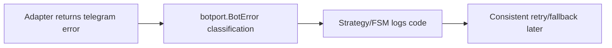
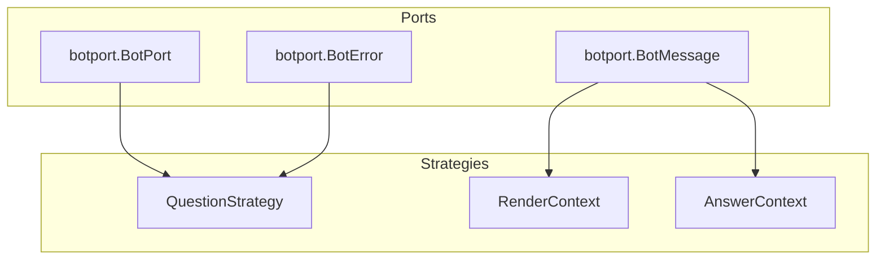

1. Executive Summary
--------------------

## Problem Statement
The codebase currently defines a minimal `BotPort` only inside `pkg/fsm/questions`, while the rest of the system still references the concrete Telegram client. This causes duplicated abstractions, inconsistent error handling, and makes strategy code subtly diverge from the main FSM expectations.

## Solution Overview
Establish a shared `pkg/ports/botport` package that exposes interfaces and value objects (BotPort, BotMessage, BotError). Update strategy contexts/tests to use the shared definitions while maintaining the existing Telegram client wiring. Success is measured by removing duplicated BotPort definitions and ensuring dependent packages reuse the new shared types.

## Success Metrics
- `pkg/fsm/questions` imports `pkg/ports/botport` (no local BotPort definition).
- At least two packages (questions + future adapters) compile using the shared interface.
- Strategy unit tests pass without referencing `pkg/bot` symbols.

2. Problem & Solution
---------------------

### Business / Technical Alignment
- **Maintainability**: A single canonical BotPort contract keeps code consistent and simplifies onboarding for maintainers.
- **Testing Readiness**: Centralizing BotMessage/BotError prepares the code for deterministic fake adapters and integration tests in later slices.
- **Extensibility**: Shared types unblock new transports without rewriting strategy helpers each time.

### Current Pain Points
- Duplicate BotPort definitions between strategies and the planned global port.
- BotMessage/BotError types do not exist, forcing direct reliance on Telegram structs.
- Lack of typed error codes prevents downstream retries or logging consistency.

### Proposed Remedy
1. Create `pkg/ports/botport` with canonical interfaces and helper types.
2. Refactor `pkg/fsm/questions` (strategy.go, contexts, tests) to import the shared package and remove local interfaces.
3. Document usage expectations (comments + AI doc linkage) to guide future adapters.

3. User Stories (with diagrams)
------------------------------

## Persona: Maintainer/Operator

### Story 1: Shared Interface Adoption
**As a** maintainer
**I want** a single `botport.BotPort` interface consumed by strategies
**So that** I avoid duplicating method signatures when extending Bot functionality.

**Acceptance Criteria:**
- [ ] `pkg/fsm/questions/strategy.go` references `botport.BotPort`.
- [ ] Local BotPort interface removed.
- [ ] Type alias or import keeps existing strategy code unchanged besides the import.

**Technical Notes:**
- Alias `type BotPort = botport.BotPort` for minimal diff.
- Ensure tests compile without `pkg/bot` import.

### Story 2: BotMessage in Context
**As a** maintainer
**I want** Render/Answer contexts to carry transport-agnostic message references
**So that** future adapters can operate without Telegram types.

**Acceptance Criteria:**
- [ ] `RenderContext` includes `botport.BotMessage` for last prompt.
- [ ] `AnswerContext` surfaces the same message reference for callback handling.
- [ ] Strategy tests updated to use the new fields (even if zero-values).

**Technical Notes:**
- Introduce helper constructors for BotMessage in tests.
- Keep optional for now; FSM injection occurs in later slices.

### Happy Path Diagram
```mermaid
graph LR
A[Strategy imports botport.BotPort] --> B[RenderContext uses shared types]
B --> C[Strategy.Render returns PromptSpec]
C --> D[FSM (future) consumes shared message]
```

### Error Scenario Diagram


4. Technical Architecture (with diagrams)
-----------------------------------------



- **Ports Layer**: Defines interfaces + helpers; no dependencies on Telegram SDK.
- **Strategy Layer**: Imports the shared types; remains transport-agnostic.
- **Adapters Layer** (future): Implements BotPort using Telegram client or fakes.

5. API Specifications
---------------------

### botport Interface (initial)
```go
package botport

type BotMessage struct {
    ChatID    int64
    MessageID int
    Transport string
    Payload   string
    Meta      map[string]string
}

type BotError struct {
    Op         string
    Code       string
    RetryAfter time.Duration
    Wrapped    error
}

type BotPort interface {
    SendMessage(ctx context.Context, chatID int64, text string, markup interface{}) (BotMessage, error)
    EditMessage(ctx context.Context, chatID int64, messageID int, text string, markup interface{}) (BotMessage, error)
}
```
- Slice 1a only requires send/edit; additional methods can be stubbed or documented for later phases.

6. Data Models
--------------

```mermaid
erDiagram
    BOTMESSAGE {
        int MessageID
        long ChatID
        string Transport
        string Payload
        json Meta
    }

    RENDERCONTEXT }
    BOTMESSAGE : carries last prompt (optional for now)
```

- `BotMessage` captures metadata to decouple from Telegram types.
- Context structs embed BotMessage for later FSM integration.

7. Implementation Phases
------------------------

| Phase | Scope | Dependencies | Output |
| --- | --- | --- | --- |
| 1 | Create `pkg/ports/botport` with interface + types | None | Compilable package referenced by strategies |
| 2 | Refactor `pkg/fsm/questions` to import shared types | Phase 1 | Updated strategy.go, contexts, tests |
| 3 | Document usage (inline comments + link to AI doc) | Phase 2 | Code comments referencing `PRPs/ai_docs/botport_hex_adapter.md` |

8. Risks & Mitigations
----------------------

| Risk | Impact | Mitigation |
| --- | --- | --- |
| Over-scoping methods prematurely | Medium | Limit slice 1a to send/edit, document future methods |
| Strategies accidentally import Telegram types | Low | Lint via `git grep tgbotapi pkg/fsm/questions` |
| Lack of adoption beyond strategies | Low | Plan future PRPs (1b–1d) to extend usage |

9. Success Metrics
------------------

- `git grep "type BotPort" pkg/fsm/questions` returns zero results.
- `go test ./pkg/fsm/questions` passes after refactor.
- `pkg/ports/botport` documented and referenced from at least two files.

10. Appendices
--------------

### Visual Documentation Plan
```yaml
diagrams_needed:
  user_flows:
    - Happy path journey
    - Error scenarios
    - Edge cases

  architecture:
    - System components
    - Data flow
    - Integration points

  sequences:
    - API interactions
    - Event flows
    - State changes

  data_models:
    - Entity relationships
    - Schema design
    - State machines
```

### Research Notes
- Internal reference: `PRPs/ai_docs/botport_hex_adapter.md` for naming/error code guidance.
- No external competitors for this slice; focus remains on internal consistency and dependency management.

### Validation Checklist
- [ ] Problem clearly articulated
- [ ] Solution addresses duplication
- [ ] User flows diagrammed (happy/error)
- [ ] Architecture visualized
- [ ] APIs specified with example signatures
- [ ] Data models included
- [ ] Dependencies/phases listed
- [ ] Risks/mitigations captured
- [ ] Success metrics measurable
- [ ] Ready for implementation PRP (`base_bot-interface` slice 1a)
