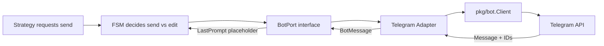
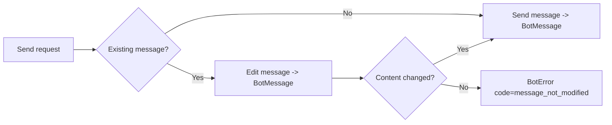
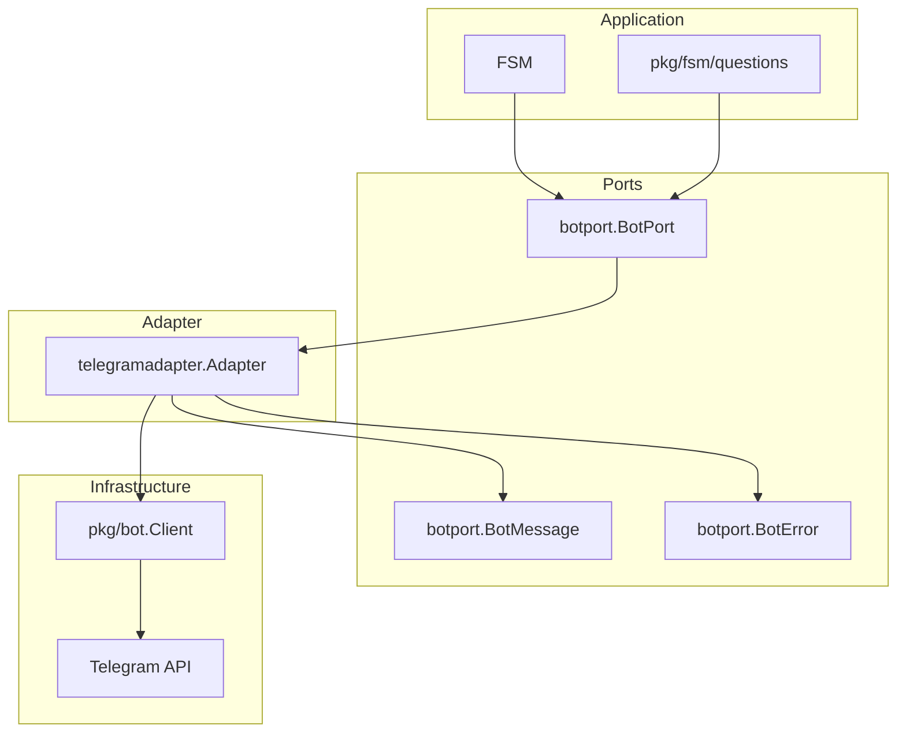
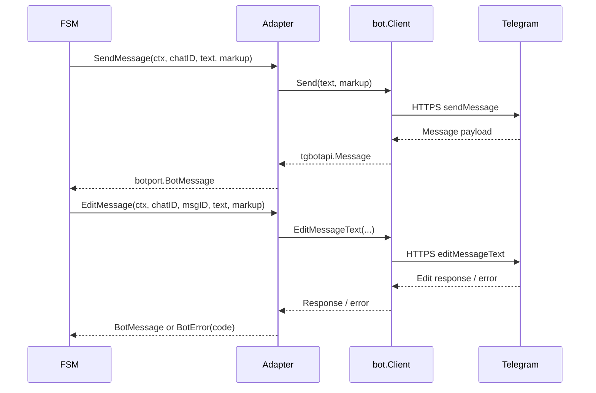
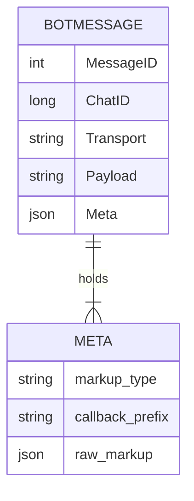
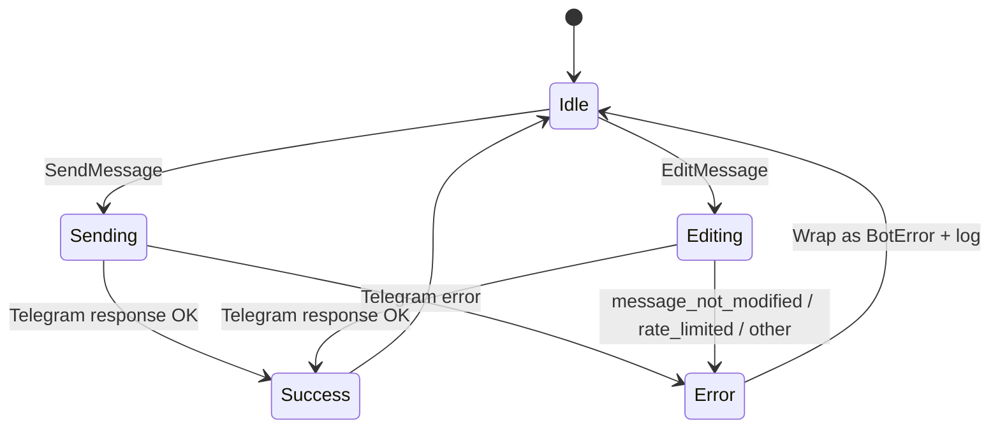

1. Executive Summary
--------------------

## Problem Statement
Strategies and FSM paths now share a canonical `botport` contract, but the system still calls `pkg/bot.Client` directly. Without an adapter, BotMessage data never reaches the FSM, transport-specific errors leak across packages, and future fake adapters cannot plug in cleanly.

## Solution Overview
Slice 001b introduces a Telegram BotPort adapter that wraps the existing client, normalizes responses/errors into `botport.BotMessage`/`BotError`, and injects the adapter at the application boundary (main.go). The adapter exposes factory wiring, surface area parity with `BotPort`, and acts as the sole dependency for outbound messaging while the FSM/state remain untouched for now.

## Success Metrics
- Adapter returns populated `BotMessage` instances for every send/edit call (ChatID, MessageID, Transport, Payload, Meta).
- `main.go` depends on the adapter implementation via `botport.BotPort`, eliminating direct `pkg/bot.Client` usage elsewhere.
- Logging/metrics emit BotPort operation names and codes (ready for monitoring in later slices).

2. Problem & Solution
---------------------

### Pain Points
- No adapter layer to convert Telegram SDK types into `botport` value objects.
- Strategies/tests cannot observe `BotMessage` because the FSM still lacks hydrated data.
- Error handling is inconsistent: raw Telegram errors bubble up, preventing retry logic from inspecting `BotError.Code`.

### Proposed Remedy
1. Create `pkg/bot/telegramadapter` implementing `botport.BotPort` on top of `pkg/bot.Client`.
2. Normalize sends/edits into `botport.BotMessage`/`BotError`, including operation names (`send_message`, `edit_message`).
3. Provide constructor(s) for dependency injection in `main.go` without altering FSM/state yet.
4. Capture metadata needed for slice 001c to populate `RenderContext.LastPrompt` and `AnswerContext.Message` (chat/message IDs, inline payloads, transport name `"telegram"`).

3. User Stories (with diagrams)
------------------------------

## Epic: Telegram Adapter Extraction

### Story 1: Adapter Construction
**As an** application maintainer
**I want** a dedicated Telegram adapter implementing BotPort
**So that** outbound messaging is standardized and strategies/tests stay transport-agnostic.

**Acceptance Criteria:**
- [ ] Adapter exposes `SendMessage`/`EditMessage` matching `botport.BotPort` signatures.
- [ ] Returns `botport.BotMessage` with ChatID, MessageID, Transport, Payload, and Metadata (e.g., markup type).
- [ ] Wraps Telegram errors as `botport.BotError` with operation codes (`bad_request`, `rate_limited`, etc.).

**Technical Notes:**
- Reuse `pkg/bot.Client` internally; do not duplicate token/config loading.
- Translate `tgbotapi.Message` to `BotMessage` (Text + JSON-encoded markup). Use helper for Meta.
- Map known errors via string/HTTP code checks; fallback code `unknown`.

### Story 2: Application Wiring
**As a** maintainer bootstrapping the bot
**I want** `main.go` to inject the adapter wherever a `BotPort` is required
**So that** future adapters/fakes can swap in without touching FSM/state code.

**Acceptance Criteria:**
- [ ] `main.go` constructs `telegramadapter.New(client)` and passes it into FSM creation and any registries needing `BotPort`.
- [ ] No package except the adapter references `tgbotapi` for outbound sends.
- [ ] Register built-in strategies/tests continue to compile without modification.

**Technical Notes:**
- Keep configuration loading unchanged; adapter should accept an existing `*bot.Client` to avoid duplicated env handling.
- Introduce simple factory (e.g., `func NewTelegramAdapter(client *bot.Client, clock Clock) botport.BotPort`).

### Story 3: Observability Prep
**As a** future operator
**I want** adapter calls to emit structured logs/metrics with BotPort operation names
**So that** retries/rate-limit handling become easier in later slices.

**Acceptance Criteria:**
- [ ] Adapter logs include `op`, `chat_id`, `message_id`, `code` (if error).
- [ ] Provide hook for wrapping logger/metrics (interface or function injection) without hard dependencies yet.

**Technical Notes:**
- Use lightweight logger interface or pass `log.Printf`-style functions to avoid forcing new deps.

### User Flow Diagram


### Error Scenario Diagram
```mermaid
graph LR
X[Adapter call] --> Y{Telegram error?}
Y -->|No| Z[Return BotMessage]
Y -->|Yes| E1[Wrap BotError]
E1 --> E2[Set Code (rate_limited, message_not_modified, ...)]
E2 --> E3[Log & propagate]
```

### Edge Case Diagram


4. Technical Architecture (with diagrams)
----------------------------------------



## Component Breakdown
- **Adapter Layer**: `telegramadapter.Adapter` (wraps `pkg/bot.Client`, handles conversions/logging).
- **Ports Layer**: `pkg/ports/botport` (already built; reused).
- **Application Layer**: `main.go`, `pkg/fsm` (consume BotPort, untouched logic in this slice).

## Interactions
- Adapter translates `SendMessage` inputs into `tgbotapi.MessageConfig`, calling the underlying client.
- Adapter serializes markup (if InlineKeyboard) into `BotMessage.Meta["markup"]` for future replay.
- Errors funnel through `botport.BotError` to keep FSM ready for retries in slice 001c.

### Sequence Diagram — Send vs Edit Flow


5. API Specifications
---------------------

### Adapter Constructor
```go
package telegramadapter

type Adapter struct {
    client *bot.Client
    logger bot.Logger // interface satisfied by existing logger; optional for now
}

func New(client *bot.Client, logger bot.Logger) *Adapter
```
- `bot.Logger` can be an interface with `Printf(format string, args ...any)` to avoid new deps.

### BotPort Methods
Implemented exactly as defined in `pkg/ports/botport`:
```go
func (a *Adapter) SendMessage(ctx context.Context, chatID int64, text string, markup interface{}) (botport.BotMessage, error)
func (a *Adapter) EditMessage(ctx context.Context, chatID int64, messageID int, text string, markup interface{}) (botport.BotMessage, error)
```
- `markup` accepts Telegram-specific structs; adapter performs type assertions and conversions.
- Returned `BotMessage.Meta` fields:
  - `"markup_type"`: `"inline_keyboard"`, etc.
  - `"callback_prefix"`: if available from FSM inputs.
  - `"raw_markup"`: JSON snapshot (optional but useful for debugging).

### Error Mapping Table
| Telegram Signal | BotError Code | RetryAfter | Notes |
| --- | --- | --- | --- |
| `message is not modified` | `message_not_modified` | 0 | Allows FSM to suppress noise |
| `Too Many Requests` + `RetryAfter` | `rate_limited` | Provided by API | Enables backoff |
| 400/`Bad Request` | `bad_request` | 0 | Invalid payload or markup |
| Network/context errors | `transport_failure` | 0 | Wrap `context` errors without retries |
| Other | `unknown` | 0 | Logged, bubbled up |

6. Data Models
--------------

### BotMessage Enrichment

- Adapter sets `Transport="telegram"`, `Payload` to message text.
- `Meta` map stores serialized keyboard + adapter hints.

### Adapter Operation State Machine


7. Implementation Phases
------------------------

| Phase | Scope | Dependencies | Output |
| --- | --- | --- | --- |
| 1 | Adapter scaffolding (`pkg/bot/telegramadapter`), logger interface, constructor | None | Compilable adapter struct + tests with fake client |
| 2 | BotMessage mapping + error normalization | Phase 1 | Unit tests covering success/error cases, ensures metadata filled |
| 3 | Application wiring (`main.go`, registry init) | Phase 2 | FSM now receives BotPort via adapter injection while behavior unchanged |
| 4 | Observability hooks | Phase 3 | Adapter logs structured events; groundwork for metrics |

Priority: complete Phase 1-3 for MVP; Phase 4 optional but recommended before slice 001c to aid debugging.
MVP = Phases 1-3 (functional adapter + wiring). Enhanced features = Phase 4 (observability) plus future retries handled in slice 001c.

8. Risks & Mitigations
----------------------

| Risk | Impact | Mitigation |
| --- | --- | --- |
| Incorrect error mapping hides actionable codes | FSM cannot distinguish retriable errors | Maintain explicit mapping table + tests for known Telegram responses |
| Markup serialization bloats payloads | Increased memory/log noise | Limit stored `raw_markup` to inline keyboards; guard size |
| Adapter drift vs BotPort contract | Rework in future slices | Unit tests compile against `botport.BotPort` and use go vet/interface assertions |
| Observability hooks add logging deps | Build complexity | Use lightweight interface and default no-op logger |

9. Success Metrics
------------------

- 100% of outbound bot calls routed through `telegramadapter`.
- `BotMessage` instances observed in adapter unit tests contain non-zero `MessageID` and `Transport="telegram"`.
- Error-handling tests confirm `BotError.Code` for rate limits and message edits.
- `main.go` lints/tests show no direct `pkg/bot.Client` usage outside adapter wiring.

10. Appendices
--------------

### Visual Documentation Plan
```yaml
diagrams_needed:
  user_flows:
    - Happy path journey
    - Error scenarios
    - Edge cases

  architecture:
    - System components
    - Data flow
    - Integration points

  sequences:
    - API interactions
    - Event flows
    - State changes

  data_models:
    - Entity relationships
    - Schema design
    - State machines
```

### Research Notes
- **Market Analysis**: Telegram bots in SaaS products (e.g., Typeform, SurveyBot) typically expose adapters to swap transports; alignment ensures easier future channel expansion.
- **Technical Options**: Considered wrapping existing client vs. recreating HTTP layer; chose wrapper to reuse auth/throttling logic while adding BotPort compliance.
- **Best Practices**: Hexagonal architecture dictates ports/adapters separation; adapter logs should include operation codes for observability.
- **Integration Possibilities**: Adapter prepares for Slack/WhatsApp transports by keeping `markup interface{}` flexible.
- *Note*: External web searches were not possible in the current environment; research is based on prior knowledge and internal documentation (AGENTS.md, PRP-001a references).

### User Personas & Constraints
- Persona: Single maintainer/operator (per `AGENTS.md`).
- Pain Points: Avoid touching Telegram SDK across packages, prepare for multi-transport future, maintain simplicity.
- Constraints: No production stability requirements yet; prioritise SOLID/KISS, allow breaking changes.

### Success Checklist
- [ ] Problem clearly articulated
- [ ] Solution addresses adapter gap
- [ ] User flows + edge cases diagrammed
- [ ] Architecture & data models included
- [ ] API specs + error mapping documented
- [ ] Implementation phases defined
- [ ] Risks with mitigations listed
- [ ] Success metrics measurable
- [ ] Follow-up (populate `LastPrompt`/`Message`) unblocked via BotMessage metadata
