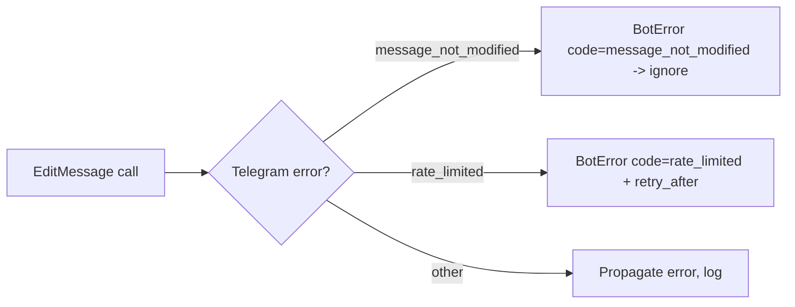
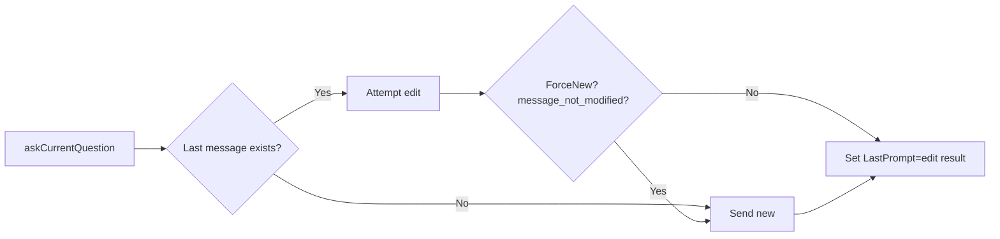
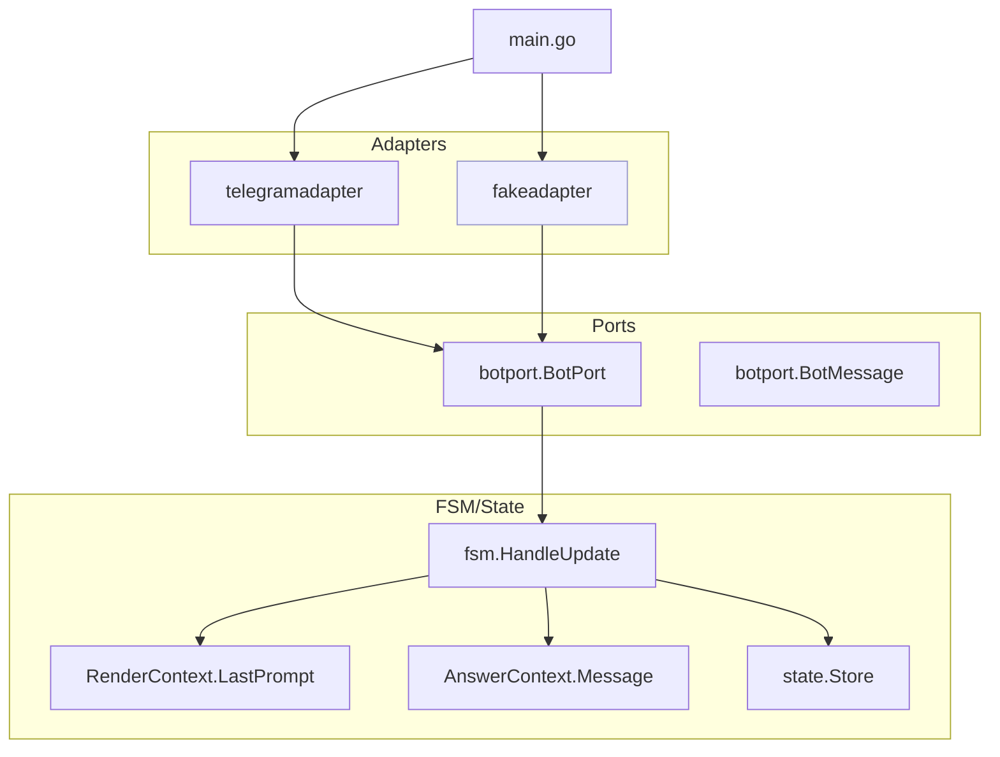
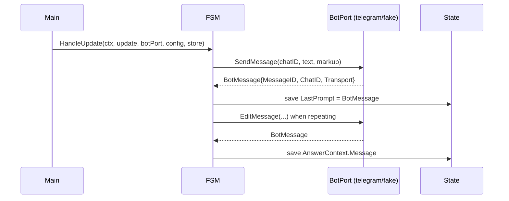
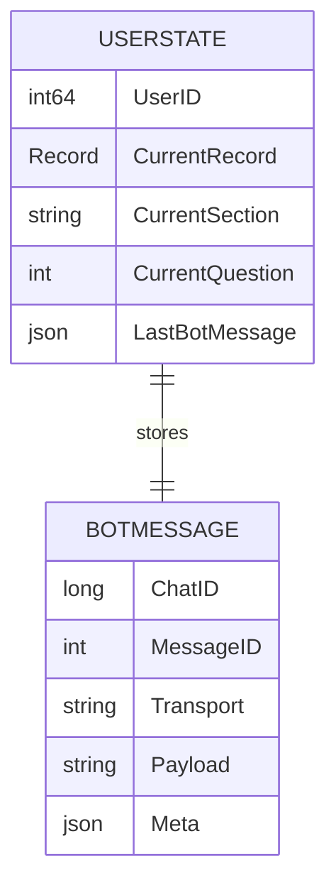

1. Executive Summary
--------------------

## Problem Statement
The FSM and state packages still depend on the concrete `pkg/bot.Client`, preventing BotMessage metadata from flowing into contexts and making it hard to test without hitting Telegram. Without a fake adapter, headless FSM tests cannot validate flows or error handling, and strategies cannot consume transport-agnostic message data.

## Solution Overview
Slice 001c rewires FSM/state to depend solely on `botport.BotPort`, injects the Telegram adapter, introduces a deterministic fake adapter for tests, and hydrates `RenderContext.LastPrompt` / `AnswerContext.Message` with `botport.BotMessage` from adapter responses. Add headless FSM tests using the fake to validate flows without network access.

## Success Metrics
- FSM/state compile and run with `botport.BotPort` (no direct `pkg/bot.Client` dependencies outside adapters/main wiring).
- `RenderContext.LastPrompt` and `AnswerContext.Message` populated from adapter returns for send/edit paths.
- Headless FSM tests (with fake adapter) cover main survey flows and error cases, passing via `go test ./pkg/fsm`.
- Docs updated so system diagrams and strategy docs reflect port-only boundaries and fake usage.

2. Problem & Solution
---------------------

### Pain Points
- FSM functions accept `*bot.Client`, leaking Telegram specifics and blocking BotMessage propagation.
- No fake adapter to run deterministic FSM tests; current tests rely on strategy unit tests only.
- Context fields (`LastPrompt`, `Message`) are unused, leaving future logic without data.

### Proposed Remedy
1. Refactor FSM/state constructors and handlers to accept `botport.BotPort` instead of `*bot.Client`.
2. Inject the real Telegram adapter in `main.go` and remove direct client usage in FSM wiring.
3. Build a fake adapter implementing `botport.BotPort`, capturing calls and returning scripted `BotMessage`s for tests.
4. Hydrate `RenderContext.LastPrompt` and `AnswerContext.Message` with adapter responses through FSM flows.
5. Add headless FSM tests using the fake adapter to validate send/edit flows, callbacks, and error handling.

3. User Stories (with diagrams)
------------------------------

## Epic: FSM Port Wiring & Fake Adapter

### Story 1: Port-Only FSM
**As a** maintainer
**I want** FSM/state to depend on `botport.BotPort`
**So that** transports can change without touching domain logic.

**Acceptance Criteria:**
- [ ] `fsm.HandleUpdate`, `askCurrentQuestion`, `processAnswer`, etc., receive `BotPort`.
- [ ] No `pkg/bot` imports outside adapters/main.
- [ ] `RenderContext.Bot` uses the injected adapter.

**Technical Notes:**
- Update constructors/handlers; adjust call sites accordingly.
- Keep behavior identical (edits vs sends) while changing types.

### Story 2: BotMessage Hydration
**As a** strategy author
**I want** contexts to carry `BotMessage` for prompts/answers
**So that** future logic (e.g., retry, persistence) uses transport-agnostic IDs.

**Acceptance Criteria:**
- [ ] FSM captures adapter responses and assigns `LastPrompt` and `Message` fields.
- [ ] Edit paths reuse `Markups` and preserve `MessageID` correctly.
- [ ] Error paths propagate `BotError.Code` for handling `message_not_modified` etc.

### Story 3: Fake Adapter & Tests
**As a** tester
**I want** a deterministic fake adapter
**So that** FSM flows can be validated without Telegram.

**Acceptance Criteria:**
- [ ] Fake captures calls (op, chatID, text, markup) and can script responses/errors.
- [ ] Headless tests exercise send/edit flows, callbacks, and error handling.
- [ ] CI-friendly: no network required; uses `go test ./pkg/fsm`.

### User Flow Diagram (Happy Path)


### Error Scenario Diagram


### Edge Case Diagram


4. Technical Architecture (with diagrams)
----------------------------------------



## Component Breakdown
- **Adapters**: Telegram adapter (real), fake adapter (tests) both implement `BotPort`.
- **FSM**: All send/edit calls route through BotPort; contexts populated with BotMessage.
- **State**: No Telegram types; stores message IDs from BotMessage.
- **Main**: Constructs the real adapter and injects into FSM; test harness injects fake.

### Sequence Diagram — Send/Edit with BotMessage hydration


5. API Specifications
---------------------

- **BotPort interface** (existing): `SendMessage(ctx, chatID, text, markup) (BotMessage, error)`; `EditMessage(ctx, chatID, messageID, text, markup) (BotMessage, error)`.
- **Fake Adapter**:
  ```go
  type Call struct { Op string; ChatID int64; MessageID int; Text string; Markup interface{} }
  type Fake struct { Calls []Call; NextMessageID int; FailNext map[string]error }
  func (f *Fake) SendMessage(ctx context.Context, chatID int64, text string, markup interface{}) (botport.BotMessage, error)
  func (f *Fake) EditMessage(ctx context.Context, chatID int64, msgID int, text string, markup interface{}) (botport.BotMessage, error)
  func (f *Fake) Fail(op string, err error)
  func (f *Fake) LastCall(op string) *Call
  ```
- **FSM constructors**: accept `botport.BotPort`. Example: `func HandleUpdate(ctx context.Context, update tgbotapi.Update, botPort botport.BotPort, recordConfig *config.RecordConfig, store *state.Store)`.
- **Context updates**: After `SendMessage`/`EditMessage`, assign `RenderContext.LastPrompt` and `AnswerContext.Message` from returned `BotMessage`.

6. Data Models
--------------

- Reuse `botport.BotMessage` for storing last prompt and answer messages.
- Extend `state.UserState` with cached BotMessage if needed for persistence or retries.

### ER Diagram (BotMessage in state)


7. Implementation Phases
------------------------

| Phase | Scope | Dependencies | Output |
| --- | --- | --- | --- |
| 1 | Introduce fake adapter implementing BotPort (tests only) | Existing botport, Telegram adapter | `pkg/bot/fakeadapter` with call recording + helpers |
| 2 | Rewire FSM/state to accept BotPort instead of *bot.Client | Phase 1 | All FSM functions/contexts take BotPort; main updated to inject telegram adapter; compile-time checks |  
| 3 | Hydrate contexts with BotMessage | Phase 2 | `askCurrentQuestion`/`processAnswer` set `LastPrompt`/`Message` from adapter responses |  
| 4 | Add headless FSM tests using fake adapter | Phases 1-3 | `go test ./pkg/fsm` covers send/edit flows, callbacks, error codes |  
| 5 | Docs update | Phases 2-4 | `docs/system-overview.md`, `docs/question-strategy.md` mention BotPort wiring + fake adapter |

Priority: Phases 1-4 for MVP; Phase 5 for documentation polish.

8. Risks & Mitigations
----------------------

| Risk | Impact | Mitigation |
| --- | --- | --- |
| FSM refactor introduces behavior regressions | Broken UX | Maintain parity tests; reuse existing edit/send logic and add fake-backed tests for flows |
| Fake adapter diverges from real adapter behavior | Tests give false confidence | Mirror BotMessage fields and error codes; add shared helper functions or fixtures |
| BotMessage not saved consistently | Downstream features lack data | Add assertions in FSM tests for `LastPrompt`/`Message` population |
| Widespread signature changes | Large diff | Stage changes (adapter injection, then hydration) and use type aliases if needed |

9. Success Metrics
------------------

- 0 direct `pkg/bot.Client` usages in FSM/state (verified via `git grep "pkg/bot" pkg/fsm pkg/state`).
- `go test ./pkg/fsm` passes with fake adapter in tests and real adapter in main wiring.
- Context fields `LastPrompt` and `Message` contain BotMessage in tests.
- Docs updated to show adapter boundary and fake test strategy.

10. Appendices
--------------

### Visual Documentation Plan
```yaml
diagrams_needed:
  user_flows:
    - Happy path journey
    - Error scenarios
    - Edge cases

  architecture:
    - System components
    - Data flow
    - Integration points

  sequences:
    - API interactions
    - Event flows
    - State changes

  data_models:
    - Entity relationships
    - Schema design
    - State machines
```

### Research Notes
- External web research unavailable in this environment; plan based on internal docs (AGENTS.md, botport_hex_adapter.md, prior PRPs) and existing code structure.
- Hexagonal pattern: ports in `pkg/ports`, adapters in `pkg/bot/*`, domain in `pkg/fsm`/`pkg/state`.
- Fake adapter should follow guidance in `PRPs/ai_docs/botport_hex_adapter.md` for message tracking and error semantics.

### Success Checklist
- [ ] Problem clearly articulated
- [ ] Solution addresses port wiring and testing gaps
- [ ] User flows + edge cases diagrammed
- [ ] Architecture & data models included
- [ ] API specs defined for fake adapter and FSM signatures
- [ ] Implementation phases ordered by dependency
- [ ] Risks + mitigations captured
- [ ] Success metrics measurable
