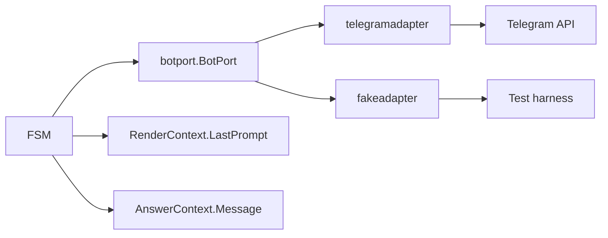
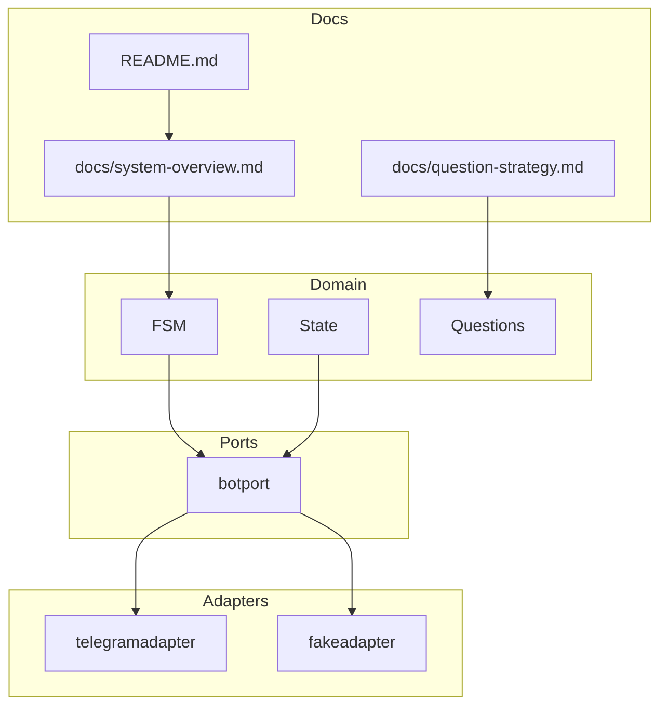

1. Executive Summary
--------------------

## Problem Statement
With the BotPort abstraction in place and FSM wired to adapters (001a–001c), documentation and validation lag behind. Developers lack a consolidated guide on the port/adapters boundary, environment toggles, and required CI guards to prevent regressions (e.g., new direct `pkg/bot.Client` references, missing BotMessage hydration). Without these, future changes risk reintroducing coupling and untested behavior.

## Solution Overview
Slice 001d delivers documentation polish (system overview, question-strategy, README) reflecting BotPort/adapters/fake usage, plus validation/CI checks to enforce port purity. It codifies verification of context hydration (LastPrompt/Message) and ensures a single source of truth for env/setup instructions.

## Success Metrics
- Docs updated to describe BotPort, adapters (real/fake), and FSM/context hydration, with diagrams reflecting the new architecture.
- CI/validation commands catch direct `pkg/bot.Client` usage in domain code and ensure `go test ./...` covers port changes.
- Onboarding steps (env vars, running with fake in tests) are documented in README/docs.

2. Problem & Solution
---------------------

### Pain Points
- Docs still reference old wiring and may omit adapter/fake patterns.
- No automated guardrails to stop regressions toward concrete Telegram client usage.
- Context hydration (LastPrompt/Message) is not documented for future developers.

### Proposed Remedy
1. Update docs (system-overview, question-strategy, README) with BotPort/adapters/fake details and context hydration notes.
2. Add validation scripts/checks (git grep, go fmt/vet/test targets) to enforce port-only domain code and BotMessage hydration expectations.
3. Provide env/instructions for running with fake adapters (for tests/local dev) and with real Telegram.

3. User Stories (with diagrams)
------------------------------

## Epic: Docs & Validation Polish

### Story 1: Documentation Update
**As a** maintainer
**I want** clear docs on BotPort, adapters, and how FSM uses BotMessage
**So that** future contributors avoid reintroducing Telegram coupling and understand hydration points.

**Acceptance Criteria:**
- [ ] `docs/system-overview.md` diagrams show BotPort boundary (adapter/fake) and context hydration.
- [ ] `docs/question-strategy.md` explains LastPrompt/Message usage and BotMessage provenance.
- [ ] README (or equivalent) mentions setup/env, running tests, and adapter roles.

### Story 2: Validation Guardrails
**As a** maintainer
**I want** reproducible checks that fail when domain depends on concrete Telegram client
**So that** port purity and hydration assumptions are preserved.

**Acceptance Criteria:**
- [ ] Script/Make target (or documented command) for `git grep "pkg/bot" pkg/fsm pkg/state` to ensure no regressions.
- [ ] gofmt/govet/gotest commands documented as the minimal validation suite.
- [ ] Optional check for `LastPrompt`/`Message` usage to prevent removal.

### Story 3: Fake Adapter Usage
**As a** tester
**I want** instructions to run FSM tests with the fake adapter
**So that** newcomers can validate without Telegram access.

**Acceptance Criteria:**
- [ ] Docs mention `pkg/bot/fakeadapter` and how headless tests work.
- [ ] No network dependencies in documented test flows.

### Diagrams


4. Technical Architecture (with diagrams)
----------------------------------------



5. API Specifications
---------------------

- No new runtime APIs; focus on validation commands and documentation updates.
- Validation/CI commands to document:
  - `go fmt ./...`
  - `go vet ./...`
  - `go test ./...`
  - `git grep "pkg/bot" pkg/fsm pkg/state`

6. Data Models
--------------

- Reference existing `botport.BotMessage`; document how LastPrompt/Message are populated to avoid divergence.

7. Implementation Phases
------------------------

| Phase | Scope | Dependencies | Output |
| --- | --- | --- | --- |
| 1 | Documentation updates (system-overview, question-strategy, README) | Completed slices 001a–001c | Updated diagrams/text reflecting BotPort/adapters/fake, hydration notes |
| 2 | Validation guardrails | Phase 1 | Documented commands/Make targets (if any) for lint/test/grep; optional scripts | 
| 3 | Onboarding instructions | Phase 1 | README updates for env vars/test runs with fake | 

8. Risks & Mitigations
----------------------

| Risk | Impact | Mitigation |
| --- | --- | --- |
| Docs drift from code | Confusion, regressions | Cross-link PRPs and note BotPort fields (LastPrompt/Message); keep diagrams current. |
| Validation ignored | Reintroduce coupling | Add commands to README/Makefile so CI can adopt them. |

9. Success Metrics
------------------

- Docs reference BotPort/adapters/fake and context hydration.
- Validation commands documented and runnable locally/CI.
- No domain references to `pkg/bot.Client` remain.

10. Appendices
--------------

### Visual Documentation Plan
```yaml
diagrams_needed:
  user_flows:
    - Happy path journey
    - Error scenarios
    - Edge cases

  architecture:
    - System components
    - Data flow
    - Integration points

  sequences:
    - API interactions
    - Event flows
    - State changes

  data_models:
    - Entity relationships
    - Schema design
    - State machines
```

### Research Notes
- Network access limited; relied on internal PRPs and current codebase (BotPort/fake/adapter wiring).
- Existing docs already partially updated in prior slices; this slice consolidates and finalizes.

### Success Checklist
- [ ] Problem clearly articulated
- [ ] Solution addresses documentation/validation gaps
- [ ] Diagrams updated for adapter boundary and hydration
- [ ] Validation commands documented
- [ ] Onboarding instructions include env/test guidance
