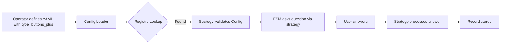
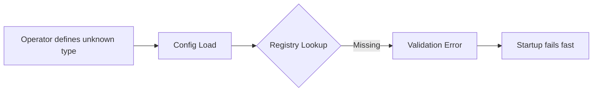
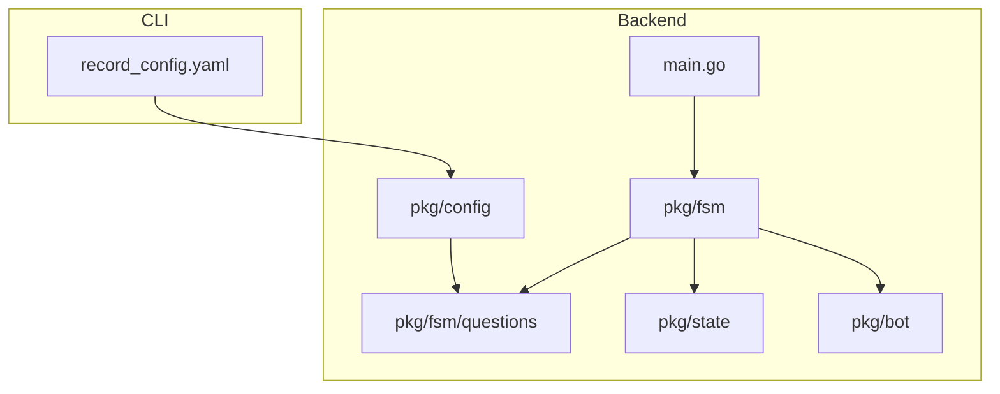
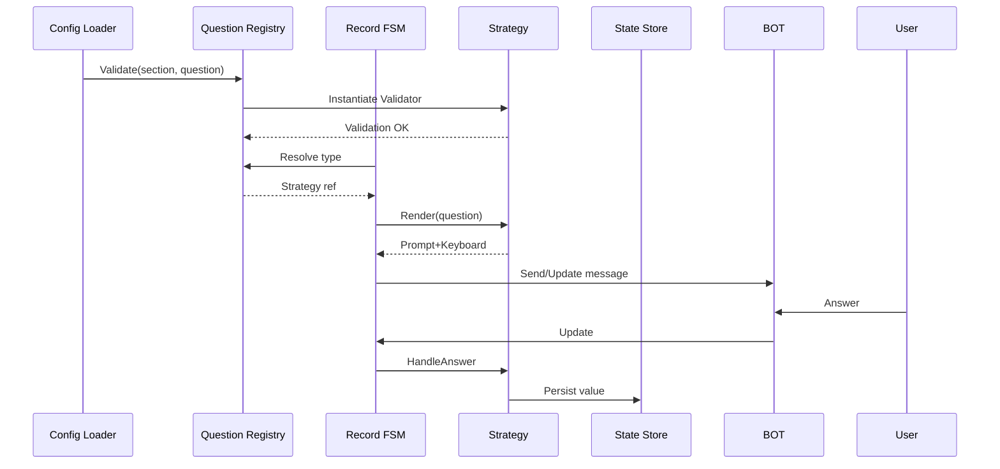
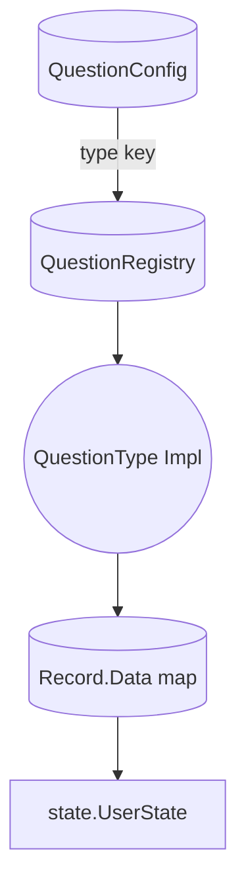
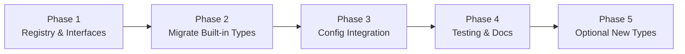

# Question-Type Strategy PRD

## 1. Executive Summary
### Problem Statement
Adding or modifying survey question types currently requires editing multiple FSM and config switch statements (`pkg/fsm/fsm.go`, `pkg/fsm/fsm-record.go`, `pkg/config/config.go`), creating tight coupling between orchestration logic and input mechanics. This slows iteration and violates SOLID goals set for the project owner/operator.

### Solution Overview
Introduce a pluggable question-type strategy registry. Each question type provides rendering, validation, and answer-processing strategies living under `pkg/fsm/questions/`. The FSM simply resolves a handler by `QuestionConfig.Type` and invokes its interface. Configuration validation also delegates to the registered strategy, keeping YAML-driven behavior consistent with README.md claims.

### Success Metrics
- Add a new question type via YAML plus a new handler file only (0 changes to FSM/config switch statements).
- Reduce places that reference question type strings from 3 packages to 1 registry.
- Provide unit tests covering at least 2 strategy implementations (text/buttons) with >80% coverage for the questions package.

## 2. Problem & Solution
### Current Pain Points
- **Operator burden:** The single maintainer must touch orchestration code every time a new type is needed.
- **Code sprawl:** Validation, rendering, and answer processing are scattered, making it easy to forget a branch.
- **Testing difficulty:** Strategies cannot be unit-tested independently.

### Proposed Remedy
- Define interfaces: `QuestionType` (capabilities), `Renderer`, `AnswerProcessor`, and `Validator` as needed.
- Create a registry keyed by `QuestionConfig.Type` responsible for validation and instantiation.
- Update FSM flows to call strategy methods rather than `switch` over types.
- Expand `record_config.yaml` schema support by referencing the registry when loading/validating.

### Visual Documentation Plan
```yaml
diagrams_needed:
  user_flows:
    - Happy path journey
    - Error scenarios
    - Edge cases

  architecture:
    - System components
    - Data flow
    - Integration points

  sequences:
    - API interactions
    - Event flows
    - State changes

  data_models:
    - Entity relationships
    - Schema design
    - State machines
```

## 3. User Stories (with diagrams)
### Personas
- **Operator (You):** Configures surveys, extends codebase, ensures maintainability.
- **Respondent:** Answers surveys only; unaffected by internal refactors but benefits indirectly from reliability.

### Epic: Extensible Question Types

#### Story 1: Register a New Question Type
**As an** operator
**I want** to add a new question style by writing a strategy and referencing it in YAML
**So that** I can experiment with richer prompts without touching FSM code.

**Acceptance Criteria**
- [ ] Strategy discovery occurs at startup; unknown types cause validation errors.
- [ ] YAML-only changes succeed when using existing strategies.
- [ ] Registry panics or logs fatal if duplicate type keys register (edge case).

**Technical Notes**
- Provide package-level `RegisterQuestionType(name string, strat QuestionType)` init hooks.
- Ensure deterministic registration order for predictable validation error messaging.

#### Story 2: Render and Process Answers via Strategies
**As an** operator
**I want** FSM handlers to call polymorphic methods
**So that** new types don’t require editing orchestration logic.

**Acceptance Criteria**
- [ ] `askCurrentQuestion` resolves `QuestionType.RenderPrompt` and `RenderKeyboard`.
- [ ] `processAnswer` routes answers to the strategy’s `HandleAnswer` method.
- [ ] Errors bubble to FSM error handling paths with user-friendly Telegram messages.

**Technical Notes**
- Pass dependencies (bot client abstraction, config details) through context objects rather than global state.

#### User Flow Diagram (Happy Path)


#### Edge/Error Flow Diagram


## 4. Technical Architecture (with diagrams)
### High-Level Architecture


### Component Responsibilities
- **`pkg/fsm/questions`**: Owns interfaces, registry, and built-in strategies (text/buttons + samples).
- **`pkg/config`**: Delegates question-type validation to registry before finalizing config.
- **`pkg/fsm`**: Consumes strategies via interfaces only.
- **`pkg/state`**: Stores resulting answers; no coupling to question-type internals.

### Sequence Diagram (State Changes)


## 5. API Specifications
The registry acts as an internal API. Proposed interfaces:

```go
type QuestionType interface {
    Name() string
    Validate(cfg config.QuestionConfig) error
    Render(ctx RenderContext) (text string, markup *tgbotapi.InlineKeyboardMarkup, err error)
    HandleAnswer(ctx AnswerContext) (nextAction ActionResult, err error)
}

type Registry interface {
    Register(q QuestionType) error
    Get(name string) (QuestionType, bool)
    MustGet(name string) QuestionType // panic/log fatal on missing
    Types() []string
}
```

- `RenderContext` includes bot interface, chat ID, message info, section/question metadata.
- `AnswerContext` contains incoming Telegram update details plus state references.
- Strategies can opt into optional interfaces (e.g., `TextAnswerStrategy`).

Error handling contract:
- Unknown type → validation error before runtime.
- Runtime errors bubble as FSM `EventForceExit` triggers with a user-facing apology message.

## 6. Data Models
### Entity Relationship Diagram


### Schema Enhancements
- `QuestionConfig` gains a generic `Options map[string]any` for type-specific metadata (extensible without struct churn).
- Each strategy documents expected keys (e.g., `options.buttons`, `options.regex`).

### FSM State Impact
- No additional FSM states; strategies return `ActionResult` struct: `{NextQuestion bool, Completed bool, Error error}` for orchestration to interpret.

## 7. Implementation Phases


1. **Foundation**
   - Implement registry, interfaces, and context structs.
   - Provide bot/config/state adapters required by strategies.
2. **Core Migration**
   - Port existing `text` and `buttons` logic into strategies.
   - Replace FSM switch statements with registry lookups.
3. **Config Validation Integration**
   - Update `pkg/config.Validate` to call strategy validators.
   - Support type-specific `options` schema.
4. **Testing & Documentation**
   - Add unit tests across registry and strategies.
   - Update README/docs diagrams; document extension steps.
5. **Enhancements**
   - Add exemplar advanced types (e.g., multi-select, file upload placeholder) to exercise extensibility.

## 8. Risks & Mitigations
| Risk | Impact | Mitigation |
| --- | --- | --- |
| Registry lifecycle errors (double registration, missing types) | Crash at startup | Provide `MustRegister` helper enforcing uniqueness with descriptive logs. |
| Increased complexity for simple types | Slower onboarding | Supply scaffolding template + docs; keep strategies lightweight. |
| Runtime errors bubbling from strategies | User confusion | Standardize error responses and ensure FSM fallback `EventForceExit` cleans up state. |
| Lack of market/competitor research due to offline environment | Potential blind spots | Document assumption, revisit when network access available. |

## 9. Success Metrics
- **Zero-touch FSM updates:** After migration, `git grep` for `question.Type` appears only under `pkg/fsm/questions/` and unit tests.
- **Registry coverage:** At least two built-in strategies registered via init and tested individually.
- **Extensibility test:** Add sample custom type in docs showing YAML-only change + new Go file.
- **Code isolation:** Cyclomatic complexity of `askCurrentQuestion` and `processAnswer` drops by ≥30% (use `gocyclo`).

## 10. Appendices
### Discovery Process Summary
1. **Concept Expansion:** Derived SOLID goals, defined success metrics (zero FSM edits, isolation, YAML-driven types).
2. **Research Notes:** No external web search possible (network restricted). Relied on Go ecosystem experience (strategy pattern, registry). Identified registries in frameworks like Terraform providers as analogues.
3. **User Research Inputs:** Operator=maintainer; respondents non-operators; no end-user pain; emphasis on clean code.

### User Interaction Points
- **Idea Validation:** Confirmed requirements via CLI Q&A (personas, metrics).
- **Research Review:** Documented lack of web access; to revisit when available.
- **PRD Review:** Requires owner approval on architecture diagrams, registry API, and success metrics before implementation PRP.

### Quality Checklist
- [x] Problem clearly articulated
- [x] Solution addresses problem
- [x] User flows diagrammed
- [x] Architecture visualized
- [x] APIs specified with examples
- [x] Data models included
- [x] Dependencies identified
- [x] Risks identified & mitigated
- [x] Success metrics measurable
- [x] Implementation phases logical
- [x] Ready for implementation PRP

