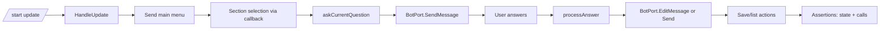
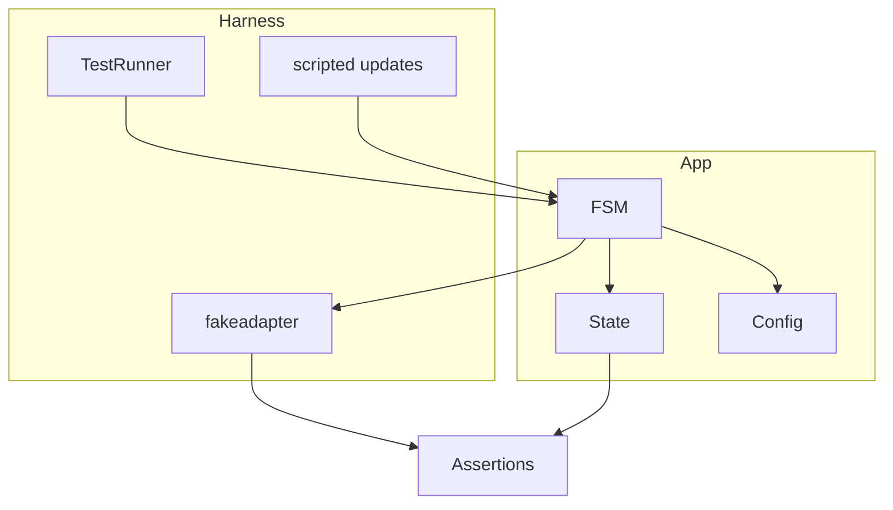

1. Executive Summary
--------------------

## Problem Statement
We lack an integration test harness that exercises Telegram flows end-to-end. Current coverage stops at unit tests and headless FSM tests; there is no automated way to drive `/start`, menu navigation, section selection, and question answering through adapters, making regressions hard to detect before deployment.

## Solution Overview
Build an integration harness that can run the bot against a controllable update source (fake Telegram or local emulator), drive common journeys (start, add record, answer questions, view list), and assert on BotPort interactions and state changes. Provide runnable commands/targets so CI can execute the harness without external Telegram access. Optionally, add an opt-in “live” test using Telegram’s **test environment** (separate account/bot) gated by env vars and skipped by default.

## Success Metrics
- Integration harness runs locally/CI without hitting real Telegram by default.
- Flows cover `/start`, section selection, answering at least one question type, saving, and listing records.
- Assertions verify state changes (UserState, records) and BotPort call sequences.
- Harness is documented and runnable via a single command (e.g., `make int-test` or `go test ./integration/...`).
- Optional live test (Telegram test environment) is gated by env vars and skipped otherwise.

2. Problem & Solution
---------------------

### Pain Points
- No automated E2E coverage of FSM + adapters beyond unit tests.
- Hard to validate regressions in markup handling, state transitions, or BotMessage hydration.
- CI cannot run Telegram-dependent tests.

### Proposed Remedy
1. Introduce an integration test package (e.g., `integration/` or `pkg/integrationtest`) using the fake adapter to simulate updates.
2. Provide canned update streams representing `/start`, button presses, text answers, and list navigation.
3. Assert on BotPort call history and state mutations to ensure flows behave as expected.
4. Add a Makefile target/command to run the harness in CI.

3. User Stories (with diagrams)
------------------------------

## Epic: Integration Test Harness

### Story 1: Happy Path Record Creation
**As a** maintainer
**I want** an automated test that drives `/start` → section selection → answering questions → save
**So that** I can catch regressions in the full flow.

**Acceptance Criteria:**
- [ ] Fake update stream triggers main and record FSM transitions without panics.
- [ ] BotPort call history shows send/edit/answer-callback in expected order.
- [ ] UserState gains a saved record with expected data.

### Story 2: List Navigation
**As a** maintainer
**I want** tests for record list pagination and back-to-menu actions
**So that** navigation regressions surface early.

**Acceptance Criteria:**
- [ ] Fake updates drive list view, next/back, and return to menu.
- [ ] BotPort edits are used when message IDs are present.

### Story 3: Error/Edge Handling
**As a** maintainer
**I want** tests covering message-not-modified and rate-limit BotError cases
**So that** the harness validates resilience behaviors.

**Acceptance Criteria:**
- [ ] Adapter errors with `message_not_modified` are ignored where expected.
- [ ] `rate_limited` errors propagate/log without crashing; harness asserts code mapping.

### User Flow Diagram


4. Technical Architecture (with diagrams)
----------------------------------------



## Optional Live Test (Telegram Test Environment)

- Telegram offers a **test environment** (separate from production) where you create a new account and bot via @BotFather. Use:
  - iOS: tap Settings icon 10 times > Accounts > Login to another account > Test
  - Telegram Desktop: Settings > Shift + Alt + Right click “Add Account” > “Test Server”
  - macOS: click Settings icon 10 times > Debug Menu > ⌘ + click “Add Account”
- Create a test bot in that environment and send requests to `https://api.telegram.org/bot<TOKEN>/test/METHOD_NAME`.
- Live test guidance:
  - Add an opt-in Go test (e.g., `integration/live_test.go`) that runs only when `TELEGRAM_TEST_TOKEN` and `TELEGRAM_TEST_CHAT_ID` are set.
  - Keep the flow minimal (send `/start`, one answer) with generous timeouts and cleanup.
  - Gate behind `make live-test` and `t.Skip` when env vars are absent.

5. API Specifications
---------------------

- Test harness helpers:
  - `type ScriptedUpdate struct { Update tgbotapi.Update; Name string }`
  - `func RunScript(ctx, script []ScriptedUpdate, botPort botport.BotPort, store *state.Store, cfg *config.RecordConfig) HarnessResult`
  - `type HarnessResult struct { Calls []fakeadapter.Call; Records []*state.Record; Errors []error }`
- Makefile target: `int-test` running `go test ./integration/...` or equivalent.
- Fake adapter already exists; reuse `pkg/bot/fakeadapter` for BotPort call assertions.

6. Data Models
--------------

- Use existing `state.Record`, `state.UserState`, and `botport.BotMessage`.
- Scripts represent `tgbotapi.Update` objects; keep them minimal (message text, callback data, chat/user IDs).

7. Implementation Phases
------------------------

| Phase | Scope | Dependencies | Output |
| --- | --- | --- | --- |
| 1 | Define scripted update helpers + harness runner | Existing fakeadapter, FSM wiring | `integration/harness.go` with helpers/types |
| 2 | Add happy-path test (start → answer → save) | Phase 1 | `integration/harness_test.go` covering full flow and assertions |
| 3 | Add navigation/error scenarios | Phase 2 | Additional scripts for list nav, message_not_modified, rate_limited |
| 4 | Wire command/target | Phase 2 | Makefile `int-test` or documented command to run harness |

8. Risks & Mitigations
----------------------

| Risk | Impact | Mitigation |
| --- | --- | --- |
| Script drift vs real updates | False confidence | Base scripts on actual update shapes from tgbotapi; keep small set of canonical flows. |
| Flaky timing/state in tests | Unreliable CI | Run FSM handlers synchronously within harness; avoid goroutines or wait for completion deterministically. |
| Overly coupled assertions | Brittleness | Assert on key behaviors (call order, state changes) rather than exact markup payloads unless necessary. |

9. Success Metrics
------------------

- `go test ./integration/...` (or equivalent) passes in CI without network.
- Scripts cover start, answer, save, list flows, and error codes.
- BotPort call sequences and state assertions catch regressions in flows.

10. Appendices
--------------

### Visual Documentation Plan
```yaml
diagrams_needed:
  user_flows:
    - Happy path journey
    - Error scenarios
    - Edge cases

  architecture:
    - System components
    - Data flow
    - Integration points

  sequences:
    - API interactions
    - Event flows
    - State changes

  data_models:
    - Entity relationships
    - Schema design
    - State machines
```

### Research Notes
- Network access is restricted; harness must remain offline using fakeadapter and scripted updates.
- Existing botport/fakeadapter can be reused; no new external dependencies needed.

### Success Checklist
- [ ] Problem clearly articulated
- [ ] Solution addresses integration coverage gap
- [ ] User flows + edge cases diagrammed
- [ ] Architecture & data models included
- [ ] API specs + harness helpers documented
- [ ] Phases ordered by dependency
- [ ] Risks + mitigations listed
- [ ] Success metrics measurable
