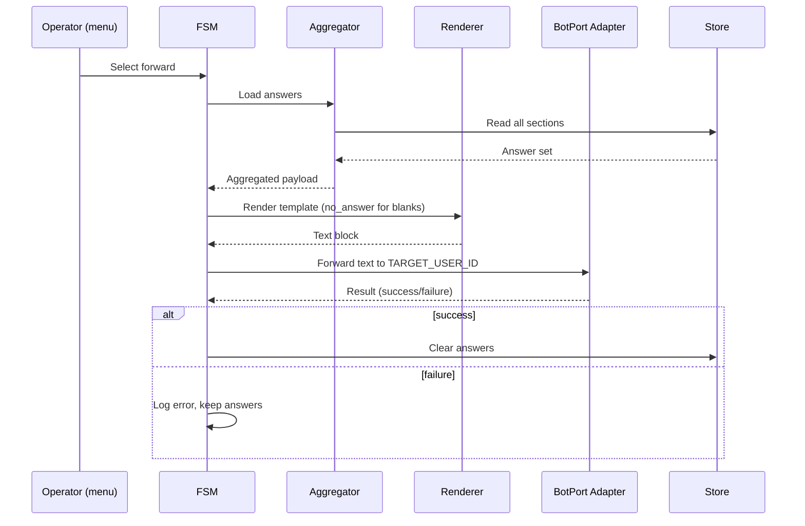
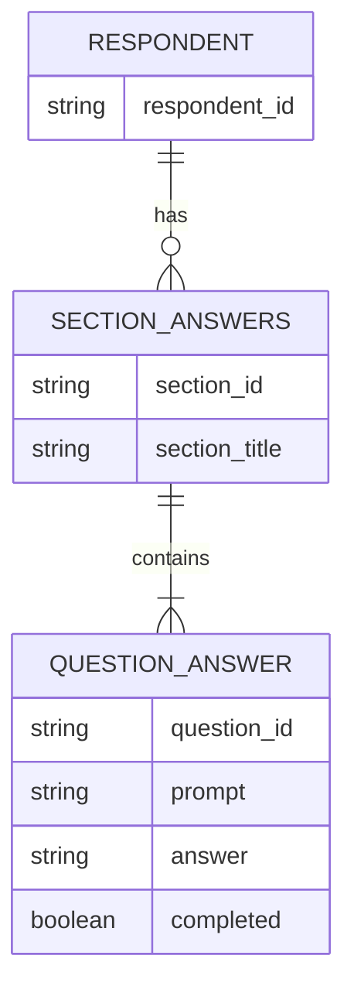

1. Executive Summary
--------------------

## Problem Statement
Operators need a one-tap main-menu action to compile all answered survey sections into a single message and forward it to a configured Telegram user ID. Today, sharing responses requires manual copy/paste and leaves stale answers stored even after forwarding.

## Solution Overview
Add a main-menu “Forward all answered sections” path that gathers the respondent’s latest answers across sections, renders a text block via a Go template (marking unanswered questions as `no_answer`), and forwards it to the target user ID from env. On success, clear persisted answers; on failure, retain data and log the error for retry.

## Success Metrics
- Feature works locally with sampled records; message delivered to env-configured user ID.
- Message contains all sections with `no_answer` placeholders for blanks.
- Answers are cleared only after a confirmed forward; failures leave data intact and logged.

2. Problem & Solution
---------------------

### Pain Points
- No built-in way to forward aggregated answers from the main menu.
- Manual copy/paste is error-prone and leaves stale data stored.

### Proposed Remedy
1. Add a main-menu item to trigger compilation and forwarding.
2. Render a structured text message via Go template to ensure predictable formatting.
3. Forward to user ID from env; on success clear answers, on failure retain and log.

3. User Stories (with diagrams)
------------------------------

## Epic: Forward Answered Sections

### Story 1: Forward compiled answers
**As an** operator  
**I want** to forward all answered sections from the main menu  
**So that** I can share survey responses quickly without manual assembly.

**Acceptance Criteria:**
- [ ] Main menu shows “Forward answered sections”.
- [ ] Selecting it sends a formatted text message with all sections to the env-configured user ID.
- [ ] Unanswered questions render as `no_answer`.
- [ ] On successful forward, stored answers are cleared for that respondent.
- [ ] On failure, answers remain stored and error is logged.

### Story 2: Retry after failure
**As an** operator  
**I want** to retry forwarding if Telegram rejects the message  
**So that** I can resend without losing responses.

**Acceptance Criteria:**
- [ ] Forward failure does not mutate stored answers.
- [ ] Operator is informed (e.g., log or BotPort error path) that forwarding failed.
- [ ] Subsequent retry uses the same stored answers.

### User Flow Diagram (Happy / Error)
```mermaid
flowchart TD
    Start[/Main menu/]
    Start --> A[Select "Forward answered sections"]
    A --> B[Load stored answers]
    B --> C{Any answers?}
    C -- No --> N[Notify nothing to forward] --> End
    C -- Yes --> D[Render Go template text block]
    D --> E[Forward to TARGET_USER_ID env]
    E --> F{Forward success?}
    F -- Yes --> G[Clear stored answers for respondent]
    G --> H[Send confirmation to operator]
    F -- No --> I[Log error, keep answers]
    I --> H
    H --> End
```

4. Technical Architecture (with diagrams)
----------------------------------------

### High-Level Components
- FSM main menu: adds “Forward answered sections” action.
- Answer aggregator: loads per-respondent answers across sections/questions.
- Template renderer: Go `text/template` or `template.Template` to produce text block with `no_answer` defaults.
- Forwarder: uses BotPort/Telegram adapter to send message to `TARGET_USER_ID` (env).
- State store: cleared only after forward success.

```mermaid
graph TB
    subgraph Bot
    Menu[Main Menu Action]
    Aggregator[Answer Aggregator]
    Renderer[Template Renderer]
    Forwarder[Forwarder (BotPort)]
    Store[(State Store)]
    end
    Env[(TARGET_USER_ID env)]
    Menu --> Aggregator
    Aggregator --> Renderer
    Renderer --> Forwarder
    Store --> Aggregator
    Env --> Forwarder
    Forwarder --> Store:::success
    classDef success stroke-dasharray: 5 5;
```

### Sequence Diagram (Success/Failure)


5. API Specifications
---------------------

- **Env**: `TARGET_USER_ID` (string/int64) — Telegram user ID to forward compiled answers.
- **Menu action**: `Forward answered sections` button/command.
- **Template**: Go template file/string; placeholders for section/question, `no_answer` default for missing responses.
- **BotPort call**: reuse send/forward method; must handle errors transparently to FSM for logging and conditional cleanup.

6. Data Models
--------------

- Answer snapshot: map of `section -> []QuestionAnswer`, where `QuestionAnswer` includes `QuestionID`, `Prompt`, `Answer` (`string`), `Completed` (`bool`).
- Forward payload: struct with `Sections []SectionAnswers`, where each `SectionAnswers` holds section title and `Questions []RenderedQA` with `Answer` defaulting to `no_answer` when `Completed` is false or missing.
- State mutation rules:
  - Clear snapshot only after forward success.
  - Keep snapshot unchanged on forward failure.

### Data Model Diagram


7. Implementation Phases
------------------------

1. **Design**: Define Go template structure (section headers, question bullets, `no_answer` default), env name `TARGET_USER_ID`, and error/logging contract.
2. **Aggregation**: Add aggregator helper to load all answered sections/questions per respondent; ensure `no_answer` substitution for blanks.
3. **Menu wiring**: Add main-menu action to call aggregator, render template, and attempt forward.
4. **Forward & cleanup**: Send via BotPort adapter to env user; on success clear answers; on failure log and keep.
5. **Validation**: Add tests for aggregation/template rendering, success cleanup, failure retention, and menu happy-path selection.
6. **Docs**: Update README/PRP slice references with env var description and operator behavior.

8. Risks & Mitigations
----------------------

- **Missing env**: If `TARGET_USER_ID` unset/invalid, forward fails. Mitigation: validate on startup/menu action and notify operator.
- **Oversized message**: Long answers may exceed Telegram limits. Mitigation: trim with ellipses or chunk by section if size detected.
- **Template drift**: Changes break formatting. Mitigation: add tests for template render output.
- **Data loss on failure**: Clearing when send fails would lose data. Mitigation: clear only on confirmed success; tests cover failure path.

9. Success Metrics
------------------

- Forwarded message matches template format with `no_answer` for blanks.
- Answers cleared upon successful forward; retained on failure.
- Operator can trigger from main menu without manual steps.

10. Appendices
--------------

- Constraints: User ID comes from env; message format is Go template-based text block; unanswered => `no_answer`; forward failure retains answers and logs. 
- Research: Internal reasoning only; no external sources due to current sandbox limits, so refine with operator feedback if needed.
