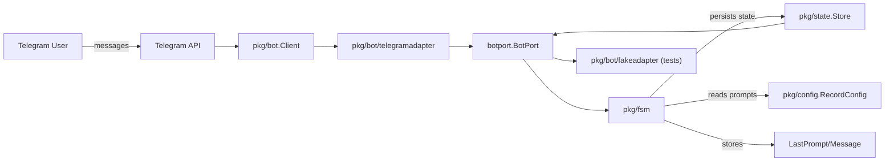

# Telegram Survey Log

A Telegram bot that guides respondents through configurable surveys, stores their answers, and lets them review completed records later. The runtime behavior is driven entirely by a finite state machine (FSM) and a YAML definition (`record_config.yaml`), so you can add or re-order sections/questions without changing the Go code.



## Key Features
- **Dynamic surveys** – sections, prompts, and input types are defined in YAML and validated on startup.
- **Two-tier FSM** – a main menu FSM handles entry points and record list navigation, while a record FSM manages section selection and question flows.
- **In-memory user state** – every user gets a dedicated `state.UserState` object that keeps their drafts, saved records, and Telegram context.
- **Rich Telegram UX** – reply keyboards for the main menu, inline keyboards for section picking, question answers, and list pagination.
- **Shareable history** – users can review the last record, copy answers, forward the latest saved (or current draft) answers to a configured reviewer, and paginate through previous submissions.

## Repository Layout

| Path | Description |
| --- | --- |
| `main.go` | Application entrypoint: loads config, wires bot + FSM, and receives updates. |
| `pkg/bot` | Thin wrapper around `go-telegram-bot-api` that adds helpers for keyboards, edits, pinning, etc. |
| `pkg/bot/telegramadapter` | Implements `botport.BotPort` for production (send/edit/answer callback), returning `botport.BotMessage` metadata. |
| `pkg/bot/fakeadapter` | Deterministic BotPort for headless tests (no Telegram network). |
| `pkg/config` | YAML schema + loader for surveys (`RecordConfig`, `SectionConfig`, `QuestionConfig`). |
| `pkg/fsm` | Main and record FSM definitions, callbacks, and handlers for Telegram updates. |
| `pkg/state` | In-memory store keyed by Telegram user ID; tracks FSM instances, drafts, and saved records. |
| `record_config.yaml` | Default survey definition (personal info, work details, additional notes). |
| `Makefile`, `docker-compose.yml` | Optional container workflow; primarily for future Postgres/API integrations. |

Additional implementation notes live in `docs/`; start with [`docs/system-overview.md`](docs/system-overview.md).

## Configuration

Set the required environment variables before launching the bot (use a shell export, direnv, or `.env` that your process manager loads):

```bash
export TELEGRAM_BOT_TOKEN=123456:ABCDEF   # required
export TARGET_USER_ID=1122334455          # required for forwarding aggregated answers
export TELEGRAM_ALLOWED_CHAT_IDS="12345,67890" # optional gating example
```

Runtime behavior comes from `record_config.yaml`. A section contains ordered questions; each question has an `id`, a prompt, answer `type`, and `store_key`. Button questions specify `options.text` (shown to the user) and `options.value` (stored).

```yaml
sections:
  personal_info:
    title: "👤 Личная информация"
    questions:
      - id: name
        prompt: "📝 Введите ваше имя:"
        type: text
        store_key: name
      - id: city
        prompt: "📍 Выберите ваш город:"
        type: buttons
        store_key: city
        options:
          - text: "Тбилиси 🇬🇪"
            value: "tbilisi"
```

`pkg/config.Validate` enforces that every section has a title, every question has a `store_key`, and button questions define at least one option.

### Forwarding answered sections

- Main menu includes “Отправить ответы ✉️”. Selecting it aggregates the latest saved record (falls back to current draft) and renders all sections via Go template, substituting `no_answer` for blanks.
- The message is sent to `TARGET_USER_ID`; on success only the forwarded record/draft is removed (other saved records remain). On failure, nothing is cleared and the operator is notified via bot message/logs.

## Running the Bot Locally

1. Install Go 1.24+.
2. Fetch dependencies (first run): `go mod download`
3. Export `TELEGRAM_BOT_TOKEN` and edit `record_config.yaml` if you need different prompts.
4. Start the bot:
   ```bash
   go run ./main.go
   ```
5. Send `/start` to your bot in Telegram and follow the reply keyboard.

The bot runs entirely in-memory today. Docker Compose includes placeholders for a Postgres database and future API/bot containers, but they rely on Dockerfiles that will live under `examples/`. Until those assets are added, prefer the direct `go run` path.

## Development Workflow

- Format before committing: `go fmt ./...`
- Run vet/tests when altering logic: `go vet ./...` and `go test ./...`
- Enforce port-only domain code: `git grep "pkg/bot" pkg/fsm pkg/state` should return nothing.
- Update `record_config.yaml` for new sections/questions; no code changes are needed unless you introduce new answer types.
- Review and update `docs/` whenever you change the FSM or high-level flow charts so diagrams stay accurate.

### Extending Question Types

Custom question behavior now lives under `pkg/fsm/questions`. Each strategy registers itself with the question registry, provides validation, renders prompts/inline keyboards, and processes answers. To add a new `QuestionConfig.Type`, implement a strategy, register it in `RegisterBuiltins()` (or a similar hook), and reference the new `type` in YAML—no changes to the FSM switch statements are required.

## Telemetry & Logs

- Startup logs confirm configuration load, bot authentication, and user state creation.
- FSM transitions log verbosely (events, sections, question IDs) to help trace survey runs.
- User data lives in memory only; restart the process to clear drafts/saved records.

## Testing with Fake Adapter

- Unit tests and new FSM headless tests use `pkg/bot/fakeadapter` to avoid Telegram network calls.
- Run the full suite locally: `go test ./...`
- For quick verification of port purity: `git grep "pkg/bot" pkg/fsm pkg/state`

## Next Steps

- Back user records with a persistent store (e.g., Postgres) and reuse the `state.Store` API as a façade.
- Extend `record_config.yaml` with validation rules (number ranges, regex) and custom renderers if needed.
