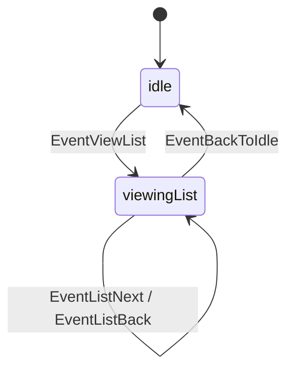
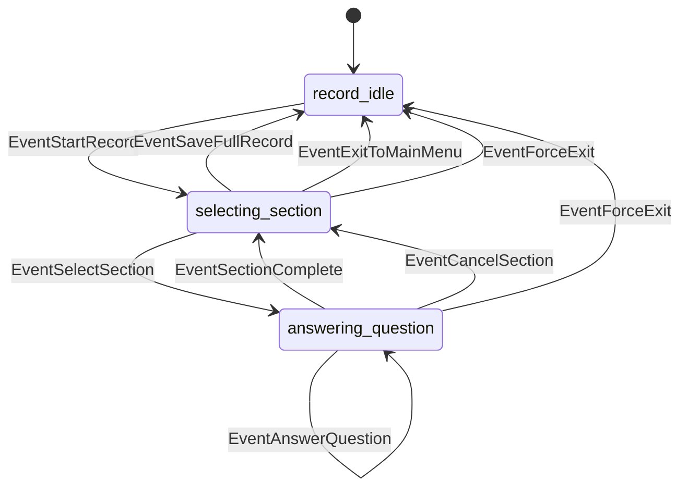

# Finite State Machines

The bot uses two Looplab FSM instances per user:

1. **Main Menu FSM** – keeps track of whether the user is browsing records or idling.
2. **Record FSM** – orchestrates section selection, question prompts, cancellations, and saving.

## Main Menu FSM

- `idle` – default state. The bot is waiting for reply keyboard actions.
- `viewingList` – the user is paginating through saved records; list navigation callbacks keep the FSM in this state until "⬆️ В главное меню" is pressed.

### Entry/Exit Effects
- Entering `viewingList` triggers `viewListHandler`, which renders a paginated inline list and stores the page offset in `userState.ListOffset`.
- Returning to `idle` removes the inline keyboard and calls `sendMainMenu`.

## Record FSM

### States

| State | Description |
| --- | --- |
| `record_idle` | The user is not editing a record. Drafts may still exist in `userState.CurrentRecord`. |
| `selecting_section` | The user sees the inline menu of sections plus the actions ("Save record", "Exit to menu"). |
| `answering_question` | The user is typing text or tapping buttons for a specific question. |

### Event Triggers

| Event | Source | Trigger |
| --- | --- | --- |
| `EventStartRecord` | `record_idle` → `selecting_section` | Button "Добавить/Продолжить запись" or `/start` when a draft exists. |
| `EventSelectSection` | `selecting_section` → `answering_question` | Inline section button (prefix `section:`). |
| `EventAnswerQuestion` | `answering_question` (loop) | Answering a question when more prompts remain in the section. |
| `EventSectionComplete` | `answering_question` → `selecting_section` | Section finished; user returns to section selection. |
| `EventCancelSection` | `answering_question` → `selecting_section` | Inline "⬅️ Назад к выбору секций". |
| `EventSaveFullRecord` | `selecting_section` → `record_idle` | Inline "💾 Сохранить запись". Record becomes immutable and gains timestamps. |
| `EventExitToMainMenu` | `selecting_section` → `record_idle` | Inline "⬆️ Выйти в меню". Draft persists for later editing. |
| `EventForceExit` | Any | Error recovery path invoked when configuration/state mismatches occur. Drafts are kept to avoid data loss. |

### Main Menu Actions
- Reply keyboard buttons: "Заполнить запись", "Показать запись", "Отправить Себе", and "Отправить Терапевту".
- Forwarding answers: "Отправить Терапевту" aggregates the most recent saved record (or current draft if none saved), renders all sections/questions with `no_answer` for blanks, sends the text to `TARGET_USER_ID`, and clears only the forwarded record/draft on success. "Отправить Себе" sends the same payload back to the user chat without clearing. Failures leave data intact and notify the operator.

### Callback Highlights

- **`enterSelectingSection`** builds the section keyboard, appending ✅ to any section with stored answers.
- **`enterAnsweringQuestion`** calls `askCurrentQuestion`, which retrieves the appropriate strategy using the `QuestionConfig.Type`, renders prompts/inline keyboards, and ensures the cancel button is always appended.
- **`handleMessage` / `handleCallbackQuery`** create `AnswerContext` objects and feed user input through the same strategy registry, letting each strategy validate and persist answers before the FSM advances.
- **`enterRecordIdle`** decides whether to save the draft, keep it, or discard it based on the triggering event and optionally edits the inline message to show final status.

## Cross-FSM Coordination

- The main FSM runs only during the list view. All record creation flows live exclusively inside the record FSM.
- User input functions (`handleMessage`, `handleCallbackQuery`) read the current states from both machines to decide whether raw text is interpreted as a free-form answer or ignored with a warning.
- `state.Store` wires both FSMs via `FSMCreator`, ensuring each user has isolated transitions and logging.

Keep the diagrams and tables above in sync whenever you add new buttons, events, or transitions.
