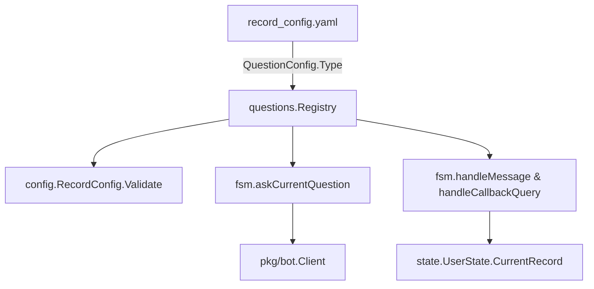

# Question Strategy Registry

This document explains how Telegram survey questions are now handled through the pluggable strategy system introduced in PRP-002. Every question type (text, buttons, future custom types) lives in `pkg/fsm/questions` and plugs into the FSM via a registry.

## Architecture



### Key Components

| File | Responsibility |
| --- | --- |
| `pkg/ports/botport/botport.go` | Canonical BotPort interface plus `BotMessage`/`BotError` helpers, shared by strategies and adapters. |
| `pkg/bot/telegramadapter` | Implements `botport.BotPort` using the Telegram client, returning populated `BotMessage` structs the FSM feeds into contexts. |
| `pkg/bot/fakeadapter` | Provides a deterministic BotPort for headless FSM tests without Telegram. |
| `pkg/fsm/questions/strategy.go` | Defines `QuestionStrategy`, contexts, prompt/result structs, and aliases `botport.BotPort` for consumers. |
| `pkg/fsm/questions/registry.go` | Thread-safe registration/lookup. Registers built-in strategies and hooks config validation via `config.RegisterQuestionValidator`. |
| `pkg/fsm/questions/text_strategy.go` | Implements text prompts: no keyboards, trims whitespace, enforces non-empty answers. |
| `pkg/fsm/questions/buttons_strategy.go` | Builds inline keyboards, validates options, parses callback payloads. |
| `pkg/config/config.go` | Provides `RegisterQuestionValidator` and delegates per-type validation to the active strategy. |
| `pkg/fsm/fsm-record.go` / `pkg/fsm/fsm.go` | Create render/answer contexts, call strategies, and only handle FSM state transitions. |

## Adding a New Question Type

1. **Create a strategy file** under `pkg/fsm/questions/` (e.g., `multi_select_strategy.go`). Implement the `QuestionStrategy` interface.
2. **Register the strategy** inside `questions.RegisterBuiltins()` or a similar bootstrap helper using `questions.MustRegister`.
3. **Update YAML** to use the new `type`, supplying any extra config fields the strategy expects.
4. **Write tests** in `pkg/fsm/questions/{type}_strategy_test.go` covering validation, render output, and answer processing.
5. **Document behavior** (examples, UX copy) in `docs/question-strategy.md` or the PRPs folder for future contributors.

## Render & Answer Contexts

Strategies receive everything they need via contexts. Bot references now flow through the shared `pkg/ports/botport` package:

```go
type RenderContext struct {
    Bot        botport.BotPort
    LastPrompt botport.BotMessage
    ChatID     int64
    MessageID  int
    UserState  *state.UserState
    Record     *state.Record
    SectionID  string
    Section    config.SectionConfig
    Question   config.QuestionConfig
}

type AnswerContext struct {
    RenderContext
    Message    botport.BotMessage
    CallbackID string
}
```

- Use `RenderContext` to craft the prompt and (optionally) inline keyboard. Strategies should stop short of sending messages directly; return a `PromptSpec` instead. The FSM will populate `LastPrompt` once adapters implement `BotPort`.
- `AnswerContext` carries callback metadata plus the inbound `botport.BotMessage`, letting handlers log/ack through `BotPort` without touching Telegram structs (most still only write to the record map). Both fields are hydrated by the FSM using the adapter (telegram in prod, fake in tests).

## Result Semantics

`AnswerResult` guides the FSM:

| Field | Meaning |
| --- | --- |
| `Advance` | Persisted answer succeeded, so `processAnswer` should move to the next question/section. |
| `Repeat` | Inputs were invalid; the FSM re-renders the same question (and shows `Feedback` if provided). |
| `Feedback` | Optional Telegram message shown to the respondent before the question is re-asked. |

The FSM enforces the following:
- When `Repeat && !Advance`, `askCurrentQuestion` is called with the same question.
- When `Advance`, `processAnswer` drives `EventAnswerQuestion`/`EventSectionComplete`.

## Testing

- Unit tests live beside strategies (`text_strategy_test.go`, `buttons_strategy_test.go`). Use `state.NewRecord()` and fake `RenderContext`/`AnswerContext`.
- `registry_test.go` ensures duplicate registrations panic and lookups work as expected; it uses the internal `resetRegistryForTests`.
- Run `go test ./pkg/fsm/questions` before any PR to ensure new strategies behave deterministically.

## FAQ

- **Where does validation happen?** During config load—`RegisterQuestionValidator` calls the appropriate strategy’s `Validate` method so startup fails fast for bad YAML.
- **Do strategies edit Telegram messages?** No. They only describe prompts; `askCurrentQuestion` handles edit vs. send logic, preserving existing UX (inline cancel button, retry flows).
- **Can strategies perform async work?** Avoid long operations; the FSM holds `state.UserState.Mu`. If external calls are required, consider async pipelines or quick responses with deferred work. 
