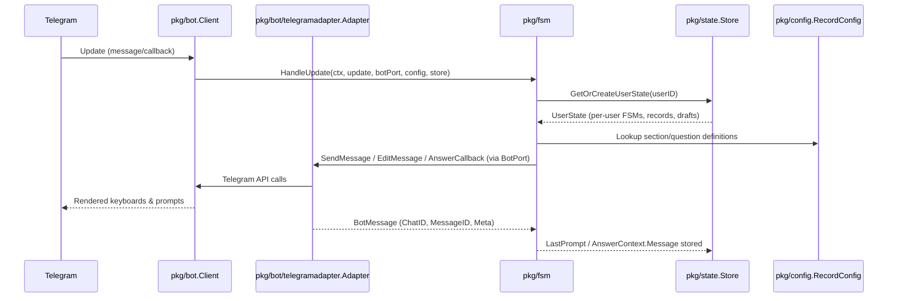

# System Overview

This document explains how the Telegram Survey Log bot processes updates, keeps track of user-specific data, and renders dynamic surveys from YAML.

## Runtime Flow

### Message Lifecycle
1. `main.go` loads `record_config.yaml`, creates a `bot.Client`, instantiates the Telegram BotPort adapter (`pkg/bot/telegramadapter`), and builds an FSM factory (`pkg/fsm.NewFSMCreator`). The FSM now receives the adapter as a `botport.BotPort`; fake adapters are used in headless tests.
2. Every Telegram `Update` is fed into `fsm.HandleUpdate`.
3. `state.Store` (a mutex-protected map) ensures each user has:
   - Dedicated main/record FSM instances.
   - A `state.Record` draft plus saved records.
   - Pointers to the current section/question, last Telegram message ID, etc.
4. Depending on the update type:
   - Messages are parsed for `/start` or main menu button text.
   - Callback queries are decoded into prefix/value pairs (`section`, `answer`, `action`, `list_nav`).
5. The record FSM drives question prompts and answer processing. Answers are persisted in the draft record via `store_key`.
6. When a section completes, the FSM loops back to section selection until the user exits or saves the record.

## Components & Responsibilities

| Component | Purpose |
| --- | --- |
| `pkg/bot` | Authenticates with Telegram, wraps message sending/editing, handles typing indicators, pin/unpin helpers. |
| `pkg/bot/telegramadapter` | Implements `botport.BotPort` on top of `pkg/bot.Client`, returning `botport.BotMessage` metadata and normalized `botport.BotError` values. |
| `pkg/bot/fakeadapter` | Deterministic BotPort implementation for headless FSM tests (no Telegram network). |
| `pkg/config` | Loads YAML, validates sections/questions/options, exposes a singleton config via `GetConfig()` and delegates per-question validation to the strategy registry. |
| `pkg/state` | Owns the `Store` map and `UserState` struct; initializes per-user FSMs through the injected `FSMCreator`. |
| `pkg/fsm` | Contains both FSM definitions, Telegram handlers, and callback implementations for transitions. Delegates question rendering/answering to the strategy package. |
| `pkg/fsm/questions` | Strategy registry plus render/answer handlers per question type (text, buttons, future extensions). See `docs/question-strategy.md` for details. |

## Survey & Message Data

- `state.Record.Data` is a `map[string]string` keyed by `store_key` from the config. The map represents the canonical, serializable dataset.
- `Record.IsSaved` switches from `false` → `true` when the user hits "💾 Сохранить запись".
- Saved records remain in memory for viewing/listing until the process restarts. Persistence (Postgres, API) can be added later without changing the FSM contract.
- Outbound prompts capture `botport.BotMessage` in `RenderContext.LastPrompt` and `state.UserState.LastPrompt`; answer handling captures `AnswerContext.Message` so strategies/future persistence can rely on transport-agnostic IDs.
- Forwarding answers: main menu action “Отправить ответы ✉️” aggregates the most recent saved record (or current draft if none saved), renders all sections/questions into a single text message with `no_answer` placeholders, sends it to `TARGET_USER_ID`, and clears only the forwarded record/draft on success. Failures keep data intact and notify the operator.

### Section Selection UX

While a user is in the `selecting_section` state, the bot shows an inline keyboard built from YAML. Any section that already has data gets a ✅ suffix, so users can revisit partially filled sections before saving.

### Question UX

- `text` type questions expect normal chat messages handled by the `textStrategy`.
- `buttons` type questions generate inline keyboard options via `buttonsStrategy`. The callback payload contains both the question ID and the selected value (`answer:<questionID>:<value>`), allowing the handler to guard against stale buttons.
- New question behaviors follow the same pattern: strategies render prompts through `PromptSpec` and persist answers via `AnswerContext`. FSM code never needs to know about the question type.

## Configuration Lifecycle

1. `config.LoadConfig(path)` reads YAML once on startup.
2. Structural validation enforces unique `store_key` values and correct button option definitions.
3. The resulting `RecordConfig` is stored in a package-level variable and shared across goroutines via `GetConfig()`.

## Extending the System

- Adding a new question type now means creating a strategy under `pkg/fsm/questions`, registering it via `questions.RegisterBuiltins`, updating YAML, and documenting behavior in `docs/question-strategy.md`—no FSM edits required.
- To persist records, wrap `state.Store` with a repository implementation that mirrors the current `UserState` API and serialize `state.Record` objects to the backing store.
